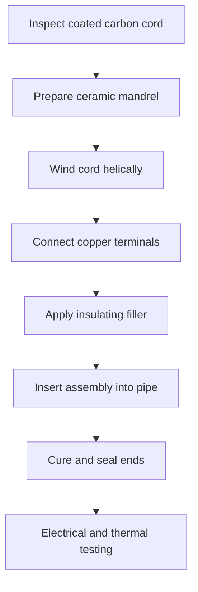
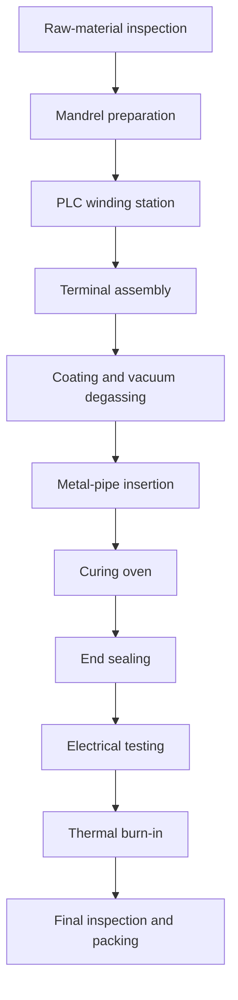

# Heat-Resistant Carbon-Fiber Cord Heater Manufacturing Process

**Discussion record and preliminary architectural design**  
**Date:** July 16, 2026

> This document consolidates the user's questions and the complete technical discussion. The design and budgets are preliminary because the final voltage, power, dimensions, operating temperature, heating medium, and production capacity have not yet been specified.

## 1. User's Initial Requirement

> I am looking for Heat-resistant coating process which has following features:
>
> - Winding on stick with carbon spring heat-resistant coated rubber
> - Inserting the wound assembly on the stick into a metal pipe

The initial interpretation was a tubular heating-element manufacturing process:

1. Wind a carbon-fiber resistance cord or carbon heating element helically around a removable stick or mandrel.
2. Coat or encapsulate the winding with heat-resistant rubber.
3. Cure the rubber.
4. Remove the mandrel if the design requires it.
5. Insert the insulated heating assembly into a metal pipe.
6. Seal the ends and connect the electrical terminals.


### Initial Equipment Concept

| Process | Recommended equipment |
|---|---|
| Mandrel preparation | Cleaning station and release-agent applicator |
| Carbon winding | CNC/PLC-controlled spiral winding machine |
| Terminal connection | Crimping or conductive-bonding station |
| Rubber coating | Silicone extrusion crosshead, dipping system, or compression mold |
| Air removal | Vacuum degassing chamber |
| Curing | Hot-air oven or continuous vulcanizing tunnel |
| Pipe insertion | Lubrication station and servo/pneumatic insertion machine |
| End sealing | Silicone dispensing and curing station |
| Inspection | Resistance, insulation, dielectric-strength and leakage testers |

High-temperature silicone rubber is normally the preferred flexible coating because it provides heat resistance, electrical insulation, and resistance to moisture and weathering. However, the carbon element must never touch the metal pipe. The insulation system must be designed for the working voltage, temperature, and required product-safety standard.

## 2. Meaning of “Carbon Spring” Clarified

> The meaning of “carbon spring” is the carbon-fiber heating cord. I do not know it well, so give me the architectural design, how many kinds of processes there are, the budget, etc.

Following this clarification, the proposed product is a metal-sheathed heater containing a silicone-insulated carbon-fiber heating cord wound around an electrically insulating mandrel.

The recommended starting method is a semi-automatic assembly process using purchased silicone-coated carbon-fiber heating cord. Manufacturing the bare carbon cord and extruding its silicone insulation inside the factory requires substantially more equipment and process knowledge.

## 3. Recommended Product Architecture

```text
Metal pipe/sheath
┌──────────────────────────────────────────────┐
│ Thermally conductive electrical insulation  │
│  ╭────────────────────────────────────────╮  │
│  │ Helically wound carbon heating cord    │  │
│  │  / / / / / / / / / / / / / / / /    │  │
│  │       Ceramic insulating mandrel        │  │
│  ╰────────────────────────────────────────╯  │
│ End seal          Temperature sensor         │
└──────────────────────────────────────────────┘
  Power lead         Earth connection
```

### Recommended Construction

| Component | Recommended material | Function |
|---|---|---|
| Heating conductor | 12K or 24K carbon-fiber heating cord | Converts electrical power into heat |
| Primary insulation | High-temperature silicone rubber | Electrically isolates the carbon fiber |
| Central mandrel | Alumina ceramic, steatite ceramic, or mica tube | Supports the helical winding |
| Gap-filling material | Thermally conductive, electrically insulating silicone | Transfers heat to the metal pipe |
| Metal sheath | SS304, SS316, or Alloy 800 | Mechanical protection and heat transfer |
| Temperature sensor | PT100, PT1000, NTC, or K-type thermocouple | Temperature regulation and monitoring |
| End seal | High-temperature silicone or ceramic cement | Moisture and mechanical protection |
| Safety protection | Thermal fuse plus temperature controller | Prevents dangerous overheating |

The supporting “stick” should normally remain inside the heater. It should be a ceramic or mica mandrel—not wood, ordinary plastic, or bare metal.

## 4. Critical Temperature Limitation

A carbon-fiber cord with silicone insulation is mainly appropriate for low- and medium-temperature heating:

- Recommended continuous sheath temperature: approximately 80–150°C
- Possible with carefully selected high-temperature materials: approximately 180–200°C
- Preliminary surface watt-density range: approximately 0.5–2 W/cm²
- Typical applications: pipe warming, anti-freezing, drying, low-temperature ovens, oil warming, and radiant heating

For sheath temperatures above approximately 200°C, the design should normally change to a conventional nickel-chromium resistance coil with compacted magnesium oxide insulation. Commercial industrial tubular heaters use MgO because it provides electrical insulation while efficiently transferring heat to the sheath.

Silicone should therefore not be treated as an unlimited high-temperature material merely because it is described as heat-resistant.

## 5. Four Available Manufacturing Processes

### 5.1 Process A — Purchase Coated Cord and Wind It

This is the recommended process for starting production.



**Advantages**

- Lowest investment
- Easiest process to control
- Suitable for prototypes and small-to-medium production
- No silicone-extrusion expertise required

**Disadvantages**

- Dependence on the coated-cord supplier
- Available cord dimensions and resistance values may be limited
- Higher material cost per heater

### 5.2 Process B — Wind Bare Carbon Cord and Dip-Coat It

The carbon cord is wound onto a ceramic mandrel, coated with liquid silicone, vacuum-degassed, and oven-cured.

**Advantages**

- Better control of winding geometry
- Coating covers the complete wound assembly
- Moderate equipment cost

**Disadvantages**

- Uniform coating thickness is difficult to obtain
- Air bubbles can cause insulation failure
- Several coating and curing cycles may be required
- Carbon-to-copper terminal areas are difficult to seal reliably

This method is useful for development but is less attractive for high-volume production.

### 5.3 Process C — Wind and Compression-Overmold

Bare carbon cord is wound around a ceramic mandrel. The complete assembly is placed in a mold and encapsulated using high-consistency or liquid silicone rubber.

**Advantages**

- Accurate external dimensions
- Consistent insulation thickness
- Strong mechanical retention of the winding
- Suitable for stable, repeated mass production

**Disadvantages**

- Dedicated molds are required for different product sizes
- Higher tooling cost
- Long heater lengths are difficult to mold
- Mold pressure can damage or displace carbon fibers

### 5.4 Process D — Manufacture Coated Carbon Cord by Extrusion

The factory receives bare carbon-fiber tow, forms the electrical terminals, extrudes silicone insulation around the cord, continuously cures the cable, and then winds the completed cord around a ceramic mandrel.

**Advantages**

- Full control of cable diameter, resistance, and insulation
- Lowest unit cost at high production volume
- The coated heating cord can be sold as a separate product

**Disadvantages**

- Highest capital investment
- Requires silicone extrusion and vulcanization expertise
- Requires spark testing, concentricity control, and continuous resistance monitoring
- Not economical for small production volumes

## 6. Recommended Semi-Automatic Factory Architecture

The following arrangement targets approximately 100–300 heaters per eight-hour shift.



### Suggested Floor Areas

| Zone | Approximate area |
|---|---:|
| Raw-material storage | 15 m² |
| Mandrel preparation and winding | 25 m² |
| Terminal assembly | 15 m² |
| Silicone mixing and coating | 20 m² |
| Pipe preparation and insertion | 25 m² |
| Curing ovens | 20 m² |
| Electrical testing | 20 m² |
| Burn-in and thermal testing | 25 m² |
| Packing and finished-product storage | 20 m² |
| **Recommended total** | **185–220 m²** |

The silicone preparation area should be kept clean and separated from pipe cutting, grinding, and welding dust.

## 7. Main Equipment and Preliminary Budget

| Equipment | Function | Estimated budget (USD) |
|---|---|---:|
| PLC spiral winding machine | Winds cord at controlled pitch and tension | $8,000–$20,000 |
| Carbon-cord tension controller | Prevents fiber damage and resistance variation | $1,500–$4,000 |
| Mandrel fixtures and tooling | Holds different heater sizes | $2,000–$8,000 |
| Resistance monitoring system | Measures cord resistance during winding | $1,500–$4,000 |
| Terminal crimping equipment | Joins carbon element to copper leads | $2,000–$8,000 |
| Silicone mixer and dispenser | Mixes and applies coating or filler | $4,000–$15,000 |
| Vacuum degassing chamber | Removes bubbles from silicone | $3,000–$10,000 |
| Pipe cutting and deburring equipment | Prepares the metal sheath | $4,000–$12,000 |
| Servo or pneumatic insertion machine | Inserts the wound assembly into the pipe | $5,000–$15,000 |
| Industrial curing oven | Cures silicone and end seals | $7,000–$20,000 |
| End-sealing dispenser | Applies controlled sealing material | $2,000–$8,000 |
| Hipot and insulation tester | Tests electrical isolation from the metal pipe | $2,000–$7,000 |
| Ground-bond tester | Tests the protective earth connection | $1,500–$4,000 |
| Power and resistance tester | Verifies rated resistance and power | $1,500–$5,000 |
| Thermal imaging camera | Checks surface-temperature uniformity | $2,000–$8,000 |
| Burn-in test racks | Operates multiple heaters under load | $5,000–$20,000 |
| Workbenches, ventilation, and safety equipment | Production support | $8,000–$25,000 |

## 8. Factory Investment Alternatives

These are preliminary 2026 planning ranges and not supplier quotations.

| Factory level | Process | Approximate capacity | Equipment budget |
|---|---|---:|---:|
| Prototype laboratory | Manual winding with purchased coated cord | 10–30/day | $20,000–$45,000 |
| Small semi-automatic factory | Process A | 100–300/shift | $80,000–$180,000 |
| Overmolding factory | Process C | 300–800/shift | $180,000–$400,000 |
| Integrated cord-extrusion factory | Process D | 1,000+/shift | $350,000–$900,000 |

### Additional Project Costs

| Additional item | Approximate allowance |
|---|---:|
| Building preparation and electrical installation | $20,000–$80,000 |
| Product design and prototype development | $15,000–$50,000 |
| Molds and product-specific tooling | $5,000–$30,000 per product family |
| Laboratory certification | $20,000–$100,000+ |
| Initial raw-material inventory | $15,000–$60,000 |
| Installation, training, and commissioning | 8–15% of equipment cost |

A realistic preliminary total investment for a reliable small factory is approximately **$140,000–$320,000**, excluding land and the building itself.

## 9. Electrical Design Example

Assume the following preliminary product:

- Supply voltage: 220 V
- Heater power: 1,000 W
- Metal pipe: 25 mm diameter × 1,000 mm long

The required total resistance is:

$$
R=\frac{V^2}{P}=\frac{220^2}{1000}=48.4\ \Omega
$$

If the selected carbon cord has a resistance of $r$ ohms per meter, the required length is:

$$
L=\frac{48.4}{r}
$$

For example, if the cord resistance is 20 Ω/m:

$$
L=\frac{48.4}{20}=2.42\text{ m}
$$

The winding pitch must accommodate 2.42 m of cord along the usable mandrel length.

The approximate surface watt density is:

$$
q=\frac{1000}{\pi(2.5)(100)}\approx1.27\text{ W/cm}^2
$$

This is within a reasonable preliminary range for a low-temperature silicone-insulated heater, but it must be validated through thermal testing.

Never cut an arbitrary carbon-cord length and connect it directly to 220 V. Resistance, cold-start behavior, terminal construction, heat dissipation, and maximum temperature must be calculated and tested first.

## 10. Carbon-to-Copper Terminal Connection

This is one of the most technically difficult areas of the product. Carbon fiber should not normally be soldered like an ordinary copper conductor.

A practical connection process is:

1. Spread or fold the carbon fibers uniformly.
2. Place the fibers inside a nickel-plated copper sleeve.
3. Add a qualified conductive compound if the validated joint design requires it.
4. Apply controlled mechanical crimping.
5. Perform joint-resistance and mechanical pull tests.
6. Overmold the joint with silicone.
7. Keep the joint outside the hottest operating zone.

Poor terminal construction creates localized resistance, overheating, oxidation, and eventual heater failure.

## 11. Required Production and Safety Tests

Every finished heater should receive:

- Electrical resistance measurement
- Rated power measurement
- Insulation-resistance test
- Dielectric withstand or hipot test
- Ground-continuity test for Class I products
- Leakage-current test
- Terminal pull test
- Surface-temperature uniformity test
- Thermal cutoff verification
- Two-to-eight-hour burn-in test
- Final dimensional and sealing inspection

The correct certification standard depends on the heater's application. Room heaters, water heaters, industrial process heaters, and embedded heating systems can be subject to different standards. IEC 60335-2-30 covers certain room-heater products, including tubular heaters, but it does not automatically apply to every possible heater.

## 12. Final Recommendation

Start with **Process A: purchased silicone-coated carbon-fiber heating cord, ceramic-mandrel winding, thermally conductive insulation, and metal-pipe insertion**.

A reasonable first prototype family would use:

- SS304 metal pipe
- 20–30 mm outside diameter
- 500–1,000 mm length
- 220 V supply
- 300–1,000 W power
- Maximum controlled sheath temperature of 120–150°C
- PT100 temperature sensor
- Independent thermal fuse
- Reliably grounded metal sheath

Build and validate a prototype line before purchasing a carbon-cord silicone-extrusion line.

## 13. Information Needed for Final Engineering

The final machine specification, layout, and firm budget require:

1. Rated voltage
2. Heater power
3. Metal-pipe diameter, wall thickness, and length
4. Maximum operating temperature
5. Material or medium being heated: air, water, oil, mold, pipe, or another material
6. Indoor or outdoor use
7. Required ingress-protection rating
8. Required daily production quantity
9. Destination country and required certification
10. Whether the heater will be straight, curved, or formed after assembly

## 14. Reference Sources

- [Watlow tubular heaters](https://www.watlow.com/-/media/documents/catalogs/tubular.ashx) — conventional metal-sheathed heater construction using centered resistance wire and compacted MgO insulation.
- [IEC 60335-2-30 scope](https://www.iecee.org/certification/iec-standards/iec-60335-2-302009) — safety scope for certain electric room heaters, including tubular heaters.
- [American Chemistry Council: silicone properties](https://www.americanchemistry.com/chemistry-in-america-industry-innovation-impact/chemistries/what-are-silicones-uses-benefits-how-they-work) — general heat, moisture, chemical, cold, and weather resistance of silicone materials.

---

**Engineering notice:** This document is a preliminary manufacturing concept, not a construction-ready electrical design. Final material selection, insulation thickness, creepage and clearance, earth bonding, thermal protection, and compliance testing must be completed by qualified electrical and product-safety engineers before production or connection to mains electricity.
