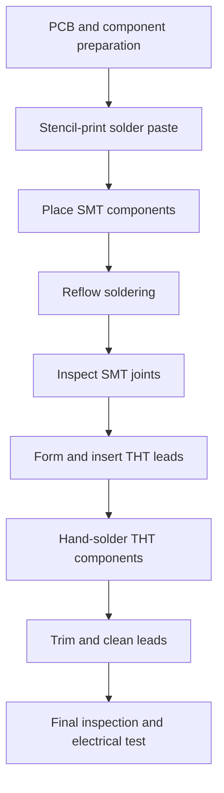

# SMT and THT Prototype Assembly — Complete Discussion

**Prepared:** July 22, 2026  
**Scope:** Mixed SMT/THT PCB assembly, prototype production under 20 boards per day, using European/Japanese premium equipment.

---

## 1. Initial Question: How Is Solder Provided in THT?

### User

> I am looking for the some tech detail for SMT ( surface mounting technology ) and THT.  
> how to provide the lead in THT ?

### Assistant

In THT (Through-Hole Technology), the component’s metal leads are inserted through holes in the PCB. Solder is then supplied from the underside to form both an electrical and mechanical joint.

The common methods are:

### 1.1 Wave soldering — best for mass production

- Components are inserted into the PCB.
- Their leads protrude from the bottom, usually about 1–2.5 mm.
- Flux is applied to the underside.
- The board is preheated.
- The underside passes over a wave of molten solder.
- Solder wets the component lead and the plated-through-hole barrel through capillary action.

Typical solder alloys:

- Lead-free: SAC305, approximately 96.5% tin, 3.0% silver, 0.5% copper.
- Leaded, where legally permitted: Sn63/Pb37.

### 1.2 Selective soldering — for mixed SMT/THT boards

A small controlled solder nozzle solders only selected THT pins. This is useful when SMT components on the underside cannot safely pass through a full solder wave.

The normal sequence is:

```text
Flux application → Preheating → Solder nozzle → Joint inspection
```

### 1.3 Hand soldering — prototypes and low-volume production

Solder wire is manually fed to the heated junction between the component lead and PCB pad.

Correct procedure:

- Place the iron tip so it touches both the pad and component lead.
- Heat the joint briefly.
- Feed solder wire into the joint—not directly onto the iron tip.
- Remove the solder wire.
- Remove the iron.
- Let the joint cool without movement.

Flux-core solder wire is normally used. A typical diameter is 0.5–1.0 mm for ordinary THT work.

### 1.4 Solder paste and pin-in-paste/reflow

Solder paste is printed over or into plated-through holes. The component leads are inserted, and the complete board passes through a reflow oven. This method can combine SMT and some THT assembly in one heating process, but it requires enough solder-paste volume to fill the holes adequately.

### Recommended THT joint

A good THT connection should have:

- Solder wetting the lead, pad, and hole barrel.
- Adequate vertical hole fill—commonly at least 75% for many quality requirements, depending on the applicable IPC class and process specification.
- A smooth, concave solder fillet.
- No bridging between neighboring pins.
- No cracks, voids, icicles, or disturbed solder.
- A properly trimmed component lead.

The basic construction is:

```text
Component body
      │
      │ Component lead
══════╪══════  Top pad
 PCB  │        Plated-through-hole barrel
══════╪══════  Bottom pad
     / \       Solder fillet
```

One terminology detail: “lead” can mean two different things:

- **Component lead:** the metal pin or wire inserted through the PCB.
- **Lead metal (Pb):** a material previously common in solder.

Modern production normally uses lead-free solder unless the product qualifies for a regulated exemption. The component leads themselves usually arrive already attached to the component; the THT assembly process inserts, forms if required, solders, and trims them.

---

## 2. Equipment and Price Request

### User

> give me the equipment list for this purpose and prices

### Assistant — production requirements requested

The equipment list depends strongly on production volume, PCB assembly type, and target equipment class. The following questions were asked:

1. What production level should the equipment list support?
   - Prototype: under 20 boards/day
   - Small production: 20–200 boards/day
   - Medium production: 200–2,000 boards/day
   - Large production: over 2,000 boards/day

2. What kind of PCB assembly will you produce?
   - Mixed SMT and THT
   - THT only
   - SMT only
   - Both as separate lines

3. Which price level should be targeted?
   - Low-cost Chinese equipment
   - Balanced industrial equipment
   - European/Japanese premium equipment
   - Comparison of all three

### User — selected requirements

> What production level should the equipment list support?  
> Prototype: under 20 boards/day
>
> What kind of PCB assembly will you produce?  
> Mixed SMT and THT
>
> Which price level should I target?  
> European/Japanese premium equipment

---

## 3. Recommended Premium Prototype Cell

### Assistant

For fewer than 20 mixed SMT/THT boards per day, a premium manual/prototype assembly cell is recommended—not a full automatic SMT line. It will comfortably support approximately 5–20 boards/day while handling frequent product changes and small component quantities.

Prices below are 2026 budgetary estimates in USD. Premium industrial equipment is often sold by quotation, so allow ±20–30%, excluding freight, tax, installation, and training.

## 4. Recommended Production Flow



## 5. Essential Equipment

| Process | Recommended premium equipment | Important specification | Estimated price |
|---|---|---|---:|
| ESD workstation | Treston or Bott ESD bench package | Grounded worktop, wrist strap monitor, ESD mat, lighting and storage | $3,000–$7,000 |
| Component storage | Totech/Super Dry dry cabinet | ≤5% RH for moisture-sensitive SMT components | $4,000–$9,000 |
| PCB/component baking | Memmert or Binder laboratory oven | Approximately 40–125°C, forced-air circulation | $3,000–$7,000 |
| Solder-paste printing | LPKF ProtoPrint S4 | Manual precision alignment, stainless-steel stencil support, single/double-sided prototypes | $6,000–$10,000 |
| Paste storage | Liebherr laboratory refrigerator | Controlled 2–8°C storage | $1,500–$3,500 |
| SMT placement | Manual vacuum placement system, such as LPKF ProtoPlace-class equipment | Camera alignment, vacuum pickup, fine-pitch placement | $7,000–$15,000 |
| Reflow oven | LPKF ProtoFlow S4-class batch convection oven | Programmable lead-free profiles, controlled heating and cooling | $12,000–$22,000 |
| Temperature profiler | KIC or Datapaq compact profiler | Minimum 6 thermocouple channels and profile-analysis software | $5,000–$10,000 |
| THT lead former | Piergiacomi or Olamef manual lead former | Adjustable span for axial components | $800–$2,500 |
| THT lead cutter/former | Piergiacomi/Olamef radial-component former | Forms and cuts radial leads consistently | $1,200–$4,000 |
| PCB assembly fixtures | Custom universal insertion and soldering fixtures | Holds THT components during board inversion and soldering | $1,000–$3,000 |
| Soldering station | Two JBC DDE/DME or equivalent stations | High thermal recovery, interchangeable precision and high-power handles | $2,000–$4,500 |
| Desoldering station | JBC DDE with DR560 or Hakko FR-410-class system | Vacuum through-hole desoldering | $1,300–$2,500 |
| Hot-air rework | JBC JTSE or Hakko FR-810/850-class system | Closed-loop temperature and airflow control | $1,300–$3,000 |
| PCB preheater | JBC PHSE/PHBE or Ersa equivalent | Thermocouple feedback; useful for multilayer and high-copper boards | $2,500–$6,000 |
| Fume extraction | BOFA V200/V250 or Purex system | Two extraction arms, HEPA and activated-carbon filtration | $2,500–$5,000 |
| Lead trimming | Piergiacomi pneumatic/electric PCB lead cutter or precision hand tools | Controlled remaining lead length | $500–$3,000 |
| Visual inspection | Vision Engineering Mantis | 3D optical inspection, approximately 4×–15× | $3,000–$6,000 |
| Cleaning | Crest or Elma ultrasonic cleaner, plus manual cleaning tools | Only for assemblies and components approved for immersion | $2,000–$5,000 |
| Electrical test bench | Keysight/Rohde & Schwarz oscilloscope, DMM, PSU and function generator | 4-channel scope, programmable supply and precision DMM | $8,000–$18,000 |
| Tools and consumables | ESD cutters, tweezers, cartridges, solder, flux, paste, stencil and thermocouples | Initial production stock | $3,000–$7,000 |

The LPKF ProtoPrint S4 is specifically intended for prototype and low-volume, single- or double-sided SMT printing. Its PCB alignment uses fine X/Y/rotation adjustment. See [LPKF ProtoPrint S4](https://www.lpkf.com/en/industries-technologies/research-in-house-pcb-prototyping/products/lpkf-protoprint-s4).

For inspection, a Vision Engineering Mantis system provides ergonomic stereoscopic viewing; configurations vary substantially by stand, camera and lenses, with representative listings beginning at roughly $2,675. See [Vision Engineering Mantis](https://www.visioneng.us/product/mantis/) and a [representative listed price](https://willrich.com/product/vision-engineering-mantis-elite-stereo-microscope/).

## 6. Budget Summary

| Configuration | Estimated equipment budget |
|---|---:|
| Essential premium manual SMT/THT cell | **$70,000–$145,000** |
| Installation, freight, training and initial spares | **$10,000–$25,000** |
| Recommended total project allowance | **$80,000–$170,000** |

A realistic purchasing target is approximately **$110,000–$130,000**.

This assumes:

- Bare PCBs and stainless-steel stencils are purchased externally.
- SMT components are placed manually with optical assistance.
- THT components are inserted and soldered manually.
- Two operators can work concurrently.
- No BGA X-ray inspection or automatic optical inspection is required.

## 7. How the THT Leads Are Handled

Component leads normally come attached to the component. The process does not manufacture the lead; it prepares and connects it:

1. Remove the component from its packaging.
2. Form axial or radial leads to match the PCB hole spacing.
3. Cut them to a manageable insertion length if necessary.
4. Insert the component into the plated-through holes.
5. Use a fixture or slightly clinch the leads to retain the component.
6. Hand-solder from the underside.
7. Trim the protruding leads after soldering, normally leaving about **1–2 mm**, subject to the assembly drawing and IPC criteria.
8. Inspect the hole fill, wetting, fillet and clearance.

For this production volume, premium hand soldering with fixtures is recommended. It gives better flexibility and lower cost than a selective soldering system.

## 8. Optional Upgrades

| Upgrade | When justified | Budget |
|---|---|---:|
| Essemtec FOX automatic pick-and-place | Many SMT placements per board or repeated batches | $90,000–$180,000 including feeders |
| Entry-level 3D AOI | Dense fine-pitch boards and documented inspection | $35,000–$90,000 |
| Desktop X-ray inspection | BGA, QFN, bottom-terminated components or critical void analysis | $70,000–$180,000 |
| Compact selective soldering machine | High THT pin count or production approaching 50–100 boards/day | $80,000–$180,000 |
| Professional BGA rework system | Frequent BGA replacement or expensive boards | $30,000–$100,000+ |

The Essemtec FOX can manage a large feeder configuration and is intended for high-mix production, but for fewer than 20 boards/day it is only financially sensible when each board has hundreds of SMT placements or placement accuracy must be highly repeatable. See [Essemtec FOX](https://essemtec.com/en/products/pick-and-place/fox/).

## 9. Recommended Purchase Strategy

Start with the **$80,000–$130,000 manual/prototype configuration**. Do not initially purchase automatic pick-and-place, AOI, X-ray or selective soldering.

The highest-priority premium investments should be:

- A reliable programmable reflow oven
- A precise stencil printer
- JBC or equivalent soldering/desoldering equipment
- Proper fume extraction
- A Mantis inspection system
- ESD control and dry storage
- A reflow temperature profiler

This arrangement is appropriately sized for the required output and can handle SMT packages down to approximately 0402 and fine-pitch ICs, assuming competent operators and correct stencil design. BGA production should add X-ray inspection or be outsourced.

---

## 10. Important Budget Note

All prices are preliminary 2026 planning estimates, not binding supplier quotations. Final purchasing decisions should be based on supplier quotations that confirm configuration, accessories, feeders, tooling, shipping, installation, training, warranty, local service, and taxes.
