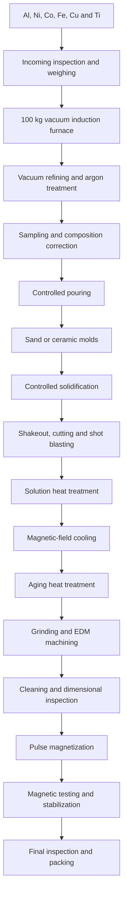
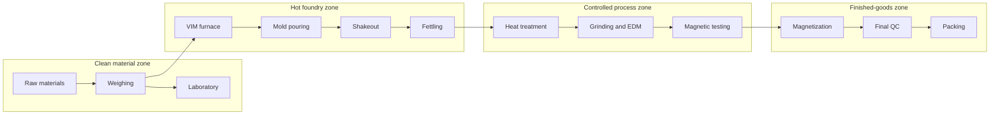

# Alnico Cast Magnet Manufacturing System

**Prepared:** July 16, 2026  
**Purpose:** Preliminary architectural design, equipment concept, plant layout, and budget for a cast Alnico permanent-magnet manufacturing facility containing a vacuum-induction melting furnace.

---

## Original request

> I am looking for alnico casting magnets manufacturing system which contains the vacuum melting furnace. Give me the architectural design, picture, total budget.

## Response

This preliminary design describes a small-to-medium cast Alnico magnet factory based on a **100 kg vacuum-induction melting (VIM) furnace**.

## 1. Design basis

Production volume, magnet dimensions, and Alnico grade were not specified, so the following assumptions are used.

| Parameter | Preliminary design |
|---|---:|
| Main products | Cast Alnico 5 and Alnico 8 magnets |
| Furnace charge | 100 kg per heat |
| Operating pattern | 2 heats/day, 250 days/year |
| Gross alloy melted | Approximately 50 tonnes/year |
| Finished-product capacity | Approximately 30–38 tonnes/year |
| Casting method | Resin-bonded sand or ceramic shell |
| Product type | Rods, blocks, horseshoes, cylinders, and custom castings |
| Electrical supply | Three-phase, normally 380–480 V, 50/60 Hz |
| Automation | PLC recipe control and production traceability |
| Building requirement | Approximately 1,800–2,500 m² |
| Personnel | Approximately 22–32 people over one or two shifts |

Cast Alnico production normally includes induction melting, casting, fettling, controlled heat treatment, grinding, inspection, and magnetization. Vacuum-induction melting improves composition control, melt homogenization, degassing, and control of oxide inclusions.

Sources: [Research overview](https://link.springer.com/article/10.1007/s11837-022-05156-9) and [ALD VIM process information](https://www.ald-vt.com/wp-content/uploads/2017/12/VIM-100-4000-Vacuum-Induction-Melting-and-Casting-2018.04-EN.pdf).

## 2. Manufacturing architecture

For anisotropic Alnico 5 or Alnico 8, the production line must control both solidification structure and heat treatment. Merely melting the correct chemical composition will not reliably produce the required magnetic performance.

## 3. Recommended vacuum melting furnace

| Item | Recommended specification |
|---|---|
| Furnace type | Tilting vacuum-induction melting and casting furnace |
| Nominal charge | 100 kg Alnico alloy |
| Practical charge range | Approximately 40–110 kg |
| Maximum temperature | At least 1,800°C; preferably 1,850°C |
| Induction power | Approximately 150–250 kW |
| Melting frequency | Medium frequency |
| Base vacuum | Approximately 1–10 Pa for normal production; lower ultimate vacuum preferred |
| Working atmosphere | Vacuum followed by high-purity argon |
| Pouring | Hydraulic or servo-controlled crucible tilt |
| Temperature measurement | Immersion thermocouple plus optical pyrometer |
| Sampling | Vacuum-compatible sampling port |
| Charging | Initial charge plus controlled alloy-addition mechanism |
| Cooling | Closed-loop deionized-water system |
| Controls | PLC, touchscreen HMI, recipe management, and alarm history |
| Records | Charge weights, vacuum, temperature, power, hold time, and operator |
| Vacuum system | Mechanical booster and backing pump; optional diffusion pump |
| Safety | Emergency argon backfill, cooling-flow interlocks, overtemperature and vacuum protection |

Commercial small VIM equipment is available in single-chamber configurations containing the chamber, induction coil, vacuum pump set, power supply, and controls. Industrial investment-casting VIM systems are offered for approximately 5–500 kg melt weights.

Sources: [ALD small VIM systems](https://www.ald-vt.com/portfolio/engineering/vacuum-metallurgy/vim-02-100-vacuum-induction-melting-furnace/) and [ALD VIM-IC systems](https://www.ald-vt.com/portfolio/engineering/vacuum-metallurgy/vacuum-induction-melting-investment-casting-furnace-vim-ic/).

**Important metallurgy point:** Aluminum is reactive and can be lost through oxidation or excessive vacuum exposure. The precise charge sequence, vacuum level, argon backfill, and final aluminum addition must be established through supplier-supervised melting trials.

Representative industrial equipment photograph: [Consarc vacuum-induction melting furnace](https://consarc.com/products/electrode-vim-furnaces/).

## 4. Main production equipment

### 4.1 Melting and casting section

- Raw-material weighing and charge-preparation station
- 100 kg VIM furnace
- Vacuum pump package
- 150–250 kW induction power supply
- Argon manifold and gas-purification system
- Closed-loop furnace cooling system
- Mold preheating oven
- Sand mixer, core-making, and molding machines
- Pattern tooling
- Pouring and mold-transfer equipment
- Shakeout machine
- Gate and riser cut-off saw
- Shot-blasting cabinet
- Local exhaust and dust collector

### 4.2 Heat-treatment section

Alnico normally needs high-temperature solution treatment, controlled cooling in a magnetic field, and subsequent aging. Exact temperatures and times are grade-dependent and must be developed as controlled production recipes.

Recommended equipment:

- 300–500 kg batch solution-treatment furnace
- Approximately 1,250°C maximum operating temperature
- Argon or controlled-atmosphere capability
- Water-cooled magnetic-field heat-treatment fixture
- DC field power supply
- Forced-air or controlled-rate cooling system
- Two aging furnaces, approximately 700°C maximum
- PLC temperature-program control
- Calibrated thermocouples and process data logging

Two aging furnaces prevent the relatively long aging cycle from blocking the entire production line.

### 4.3 Machining and finishing

Because Alnico is hard and brittle, aggressive conventional machining is unsuitable. Final dimensions are generally obtained through abrasive grinding and, for difficult holes or profiles, EDM.

- Two surface grinders
- Two centerless or cylindrical grinders
- Diamond grinding wheels
- Wire EDM
- Sinker EDM for special holes
- Double-disc or profile grinder
- Ultrasonic washing and drying station
- Dimensional inspection instruments
- Grinding-coolant filtration
- Separate wet dust collection where required

### 4.4 Magnetization and testing

- 20–40 kJ capacitor-discharge magnetizer
- Interchangeable magnetizing fixtures
- Helmholtz coil or fluxmeter
- Gaussmeter
- Hysteresisgraph or B-H tracer
- Magnetic-moment measurement station
- Temperature-stability test oven
- Demagnetization/stabilization fixture
- Coordinate measuring machine or optical comparator
- XRF or optical-emission spectrometer for alloy chemistry

Alnico has high remanence but comparatively low coercivity. Product geometry, magnetizing fixture, keeper, and final assembly condition must therefore be considered during magnetic testing.

## 5. Preliminary plant layout

| Area | Approximate size |
|---|---:|
| Raw materials and charge preparation | 180 m² |
| Molding and core preparation | 300 m² |
| VIM melting and pouring | 280 m² |
| Shakeout, fettling, and blasting | 220 m² |
| Heat treatment | 240 m² |
| Grinding and EDM | 300 m² |
| Magnetization and testing | 160 m² |
| Laboratory and quality control | 100 m² |
| Packing and finished-goods storage | 150 m² |
| Utilities and maintenance | 200 m² |
| Offices, changing, and circulation | 250–400 m² |
| **Total** | **Approximately 2,000–2,500 m²** |

The VIM furnace should be located close to an exterior service wall so the vacuum pumps, cooling system, and transformer can be maintained without entering the clean production area. Molding and shakeout areas should be negatively ventilated relative to inspection and finishing areas.

## 6. Utility requirements

| Utility | Preliminary requirement |
|---|---:|
| Connected electrical load | 650–950 kW |
| Typical operating demand | 350–600 kW |
| Furnace transformer | Approximately 500–800 kVA |
| Total plant transformer | Approximately 1,000–1,250 kVA |
| Closed-loop cooling | 80–150 m³/h circulation |
| Cooling-tower heat rejection | Approximately 400–700 kW |
| Argon | Approximately 20–50 Nm³ per tonne, subject to trials |
| Compressed air | 6–8 bar, approximately 5–10 Nm³/min |
| Exhaust air | Approximately 30,000–50,000 m³/h plant total |
| Overhead crane | 3–5 tonnes over melting and heat-treatment area |

## 7. Preliminary capital budget

These are 2026 rough-order-of-magnitude budget figures—not supplier quotations—and should be considered approximately **±35%** until formal quotations and site requirements are available.

### 7.1 Cost-effective Asian equipment package

| Equipment/package | Budget, USD |
|---|---:|
| 100 kg VIM furnace and vacuum system | $400,000–$750,000 |
| Furnace chiller, transformer, and electrical equipment | $180,000–$350,000 |
| Molding, sand preparation, and core equipment | $180,000–$350,000 |
| Mold ovens and pouring accessories | $80,000–$160,000 |
| Shakeout, cutting, and shot blasting | $130,000–$260,000 |
| Solution and aging furnaces | $250,000–$500,000 |
| Magnetic-field heat-treatment system | $180,000–$400,000 |
| Grinding, EDM, and coolant systems | $350,000–$700,000 |
| Magnetizer and magnetic testing | $180,000–$350,000 |
| Metallurgical and dimensional laboratory | $120,000–$250,000 |
| Dust collection and environmental controls | $220,000–$450,000 |
| Material handling and crane | $100,000–$200,000 |
| Installation and commissioning | $350,000–$700,000 |
| Initial tooling and production trials | $150,000–$350,000 |
| **Equipment project subtotal** | **$2.9–$5.8 million** |

### 7.2 European/US premium equipment package

Potential premium suppliers include ALD, Consarc, Inductotherm-group companies, or comparable vendors.

| Package | Budget, USD |
|---|---:|
| Complete production equipment | $5.5–$9.0 million |
| Installation, engineering, and commissioning | $1.0–$2.0 million |
| Initial tooling and process qualification | $300,000–$700,000 |
| **Equipment project subtotal** | **$6.8–$11.7 million** |

### 7.3 Building and complete project

| Cost category | Asian equipment | European/US equipment |
|---|---:|---:|
| Production equipment project | $2.9–$5.8M | $6.8–$11.7M |
| 2,000–2,500 m² industrial building | $1.2–$3.0M | $1.5–$3.5M |
| Engineering, permits, and contingency | $500,000–$1.3M | $900,000–$2.0M |
| Initial raw materials and working capital | $400,000–$1.0M | $500,000–$1.2M |
| **Total project excluding land and tax** | **$5.0–$11.1M** | **$9.7–$18.4M** |

### Recommended cost-performance target

A practical target is approximately **$6–8 million excluding land**, using a reputable Asian VIM and foundry package together with higher-quality European or Japanese magnetic-test instruments, controls, and critical vacuum components.

## 8. Safety and environmental requirements

- Independent cooling-flow interlocks on the induction coil and furnace
- Emergency power and argon-backfill arrangements
- Molten-metal spill pit and refractory floor
- Strict water exclusion around molten-metal handling
- Nickel and cobalt exposure monitoring
- Local exhaust at weighing, shakeout, grinding, and blasting
- Formal combustible-metal-dust hazard analysis
- Separated wet collection for applicable metal grinding dust
- Respiratory silica controls if silica sand is used
- Crane, furnace, and magnetizer safety interlocks
- Restricted magnetization area for pacemaker and ferromagnetic-projectile hazards

Respirable crystalline silica can cause silicosis, lung cancer, and other serious disease. Foundry molding and shakeout therefore require engineered dust controls and exposure monitoring.

Sources: [OSHA crystalline-silica guidance](https://www.osha.gov/silica-crystalline) and [American Foundry Society silica resources](https://www.afsinc.org/silica).

## 9. Information required for the detailed engineering stage

Before issuing supplier RFQs or completing foundation, electrical, piping, and ventilation drawings, the following must be confirmed:

1. Required finished-magnet capacity in tonnes per year.
2. Alnico grades to be produced.
3. Isotropic, anisotropic, or directionally solidified product requirements.
4. Minimum and maximum magnet dimensions and unit weights.
5. Required dimensional tolerances and surface finish.
6. Required magnetic-property tolerances.
7. Available site area and building restrictions.
8. Local electrical voltage, frequency, gas availability, and cooling-water conditions.
9. Destination country and applicable environmental, fire, electrical, and occupational-safety codes.
10. Preferred equipment origin and acceptable automation level.

Once these inputs are fixed, the concept can be developed into a supplier-ready RFQ with equipment datasheets, a scaled plant layout, utility balance, foundation loads, piping schematics, and a more accurate project budget.

---

## Follow-up request

> Can you write all the discussions in this channel into a Markdown file and give me a download?

This document contains the complete substantive discussion from the channel, including the original request, design assumptions, process architecture, equipment specifications, layout concept, utilities, budget, safety requirements, sources, and follow-up request.
