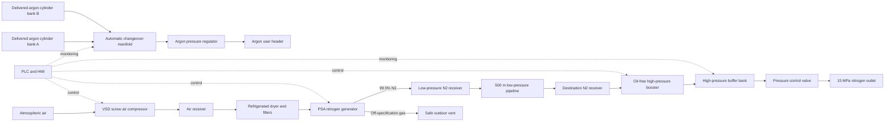

# Industrial Nitrogen–Argon Mixed Gas Production System

## Complete Discussion Transcript

This document compiles the full discussion regarding the proposed industrial nitrogen and argon production and supply system, including the original questions and the subsequent technical responses.

---

## Question 1

> I need a design for an industrial mixed gas production process: nitrogen (99.5% purity) and argon (also 99.5%).
>
> Annual production: 150k m³ of N₂, daily 400 m³ at 50 Nm³/h;
> Supply via pipeline length 500 m, pressure at outlet 15 MPa for nitrogen.
> Argon annual 3500 m³.
>
> Storage in steel containers for argon.
> Use PLC Control, 3-phase 380V power.
>
> They want a small-to-medium company solution: intermittent production, cost-effective, high-performance ratio, relatively inexpensive.
>
> They want detailed specification: equipment list, technical specs, design layout, cost estimate.

---

# Response 1: Preliminary Industrial Nitrogen–Argon Plant Design

## 1. Recommended solution

The term “mixed gas production” is interpreted as a **dual-product facility with separate nitrogen and argon systems**, rather than a premixed N₂/Ar gas stream.

For this production scale, the most cost-effective architecture is:

- Produce nitrogen on-site using a PSA nitrogen generator.
- Transmit nitrogen through the 500 m pipeline at approximately 7–9 bar.
- Install the nitrogen booster near the final user, raising pressure to 15 MPa only at the destination.
- Purchase industrial argon from a gas supplier and store it in certified steel-cylinder banks.
- Control both systems from a common PLC/HMI.

Producing argon on-site is technically possible only through a cryogenic air-separation process with an argon column and purification section. Argon represents only about 0.93% of atmospheric air, and the required argon demand is too small to justify a dedicated cryogenic plant.

## 2. Design basis

| Parameter | Design value |
|---|---:|
| Nitrogen purity | ≥99.5 vol.% |
| Nitrogen nominal flow | 50 Nm³/h |
| Nitrogen generator design flow | 60 Nm³/h |
| Nitrogen annual requirement | 150,000 Nm³/year |
| Nitrogen daily requirement | 400 Nm³/day |
| Nitrogen operating time | 8 hours/day at 50 Nm³/h |
| Annual operating time | 3,000 hours/year |
| Nitrogen final outlet pressure | 15 MPa(g), assumed |
| Nitrogen pipeline length | 500 m |
| Argon purity | ≥99.5 vol.% |
| Argon annual requirement | 3,500 Nm³/year |
| Argon design consumption | Approximately 12 Nm³/day |
| Argon storage | Steel cylinders or cylinder bundles |
| Electrical supply | 3-phase, 380 V |
| Control | PLC/HMI, automatic intermittent operation |

### Production-data discrepancy

The nitrogen figures do not align perfectly:

- 150,000 Nm³/year ÷ 400 Nm³/day = 375 operating days/year
- At 300 operating days/year, average demand would be 500 Nm³/day
- At 50 Nm³/h, annual operating time is exactly 3,000 hours

The plant can be designed around the firm requirements of 50 Nm³/h peak flow and 150,000 Nm³/year.

## 3. Recommended process scheme



This split-pressure arrangement is preferable to transporting nitrogen for the entire 500 m at 150 bar. It confines the high-pressure equipment and piping to a small, protected destination area.

## 4. Nitrogen production equipment

### 4.1 Main equipment specification

| Tag | Equipment | Preliminary specification |
|---|---|---|
| AC-101 | VSD rotary screw air compressor | 3.5–4.5 m³/min FAD; 8–10 bar(g); 22–30 kW; air-cooled; 380 V, 3-phase |
| V-101 | Compressed-air receiver | 1.0–1.5 m³; design pressure 11–13 bar; automatic condensate drain |
| DR-101 | Refrigerated air dryer | ≥4.5 m³/min; pressure dew point ≤+3°C |
| F-101A/B/C | Air filtration set | Water separator, 3 μm prefilter, 0.01 μm coalescing filter, activated-carbon filter |
| NG-101 | PSA nitrogen generator | 60 Nm³/h at ≥99.5% N₂; 6–8 bar outlet; PLC controlled |
| AI-101 | Oxygen analyzer | Range approximately 0–1% O₂; automatic off-specification diversion |
| V-102 | Low-pressure N₂ receiver | 1.5–2.0 m³; 10–11 bar design |
| FT-101 | Nitrogen flowmeter | 0–75 Nm³/h; totalizer and Modbus output |
| AT-101 | Nitrogen dew-point analyzer | Recommended measuring range to at least −60°C |
| PCV-101 | Low-pressure control valve | Maintains 7–8 bar pipeline pressure |

### Recommended guaranteed performance

| Performance item | Required guarantee |
|---|---:|
| Product flow | 60 Nm³/h minimum |
| Product purity | ≥99.5 vol.% N₂ |
| Residual oxygen | ≤0.5 vol.% |
| Product pressure | ≥7 bar(g) |
| Product dew point | ≤−40°C at atmospheric reference pressure |
| Turndown | Preferably 30–100% |
| Start-up to specification | Preferably ≤30 minutes |
| Automatic standby | Included |
| Purity diversion | Included |
| CMS design life | Vendor guaranteed |
| Noise | ≤80–85 dB(A) at 1 m |

### 4.2 Air-compressor sizing

Using a preliminary PSA air factor of 2.5–3.0 Nm³ compressed-air feed per Nm³ nitrogen:

\[
60\ \text{Nm³/h N₂}\times 2.5\text{–}3.0
=150\text{–}180\ \text{Nm³/h air}
\]

This corresponds to approximately 2.5–3.0 m³/min nominal free-air demand.

A compressor rated at 3.5–4.5 m³/min provides allowance for:

- High ambient temperature
- Filter and dryer losses
- Compressor aging
- Altitude derating
- Future production growth

A 22–30 kW screw compressor is a practical size range.

## 5. Nitrogen transmission and final compression

### 5.1 Recommended 500 m pipeline

| Parameter | Recommended value |
|---|---:|
| Normal pipeline pressure | 7–8 bar(g) |
| Pipeline design pressure | 16 bar minimum |
| Nominal pipeline size | DN32 recommended |
| Minimum practical size | DN25 |
| Material | Coated seamless carbon steel or stainless steel |
| Estimated DN32 pressure loss | Less than approximately 0.1 bar |
| Isolation valves | At both ends and intermediate accessible points |
| Burial depth/support | According to local mechanical and vehicle-load requirements |
| Pipeline identification | “NITROGEN – ASPHYXIANT” with flow arrows |

DN25 could carry 50 Nm³/h with a preliminary pressure loss of approximately 0.2 bar over 500 m. DN32 is preferable because it reduces pressure loss and provides expansion capacity.

### Recommended installation

For an underground line:

- Seamless carbon-steel pipe with external three-layer PE or approved corrosion protection
- Welded joints
- Protective sleeves at roads and building penetrations
- Buried warning tape and route markers
- Low-point condensate provision where moisture could enter
- Code-compliant pressure testing
- Nitrogen purge and drying before service

For an above-ground line:

- Stainless steel or coated carbon steel
- Pipe supports approximately every 3–4 m, subject to calculation
- Expansion loops or calculated flexibility
- Protection from vehicle impact and unauthorized access

### 5.2 Destination booster station

| Tag | Equipment | Preliminary specification |
|---|---|---|
| V-201 | Booster suction receiver | 1.0–1.5 m³; 10–11 bar design |
| BC-201 | Nitrogen booster | 60 Nm³/h; suction 6–8 bar; discharge 16 MPa; oil-free reciprocating; 18.5–22 kW |
| V-202 | High-pressure buffer | 0.8–1.0 m³ water volume; 20–25 MPa design; cylinder cascade preferred |
| PCV-201 | Final pressure controller | Reduces approximately 15.5–16 MPa to stable 15 MPa |
| PSV-201 | Pressure relief device | Set according to vessel MAWP and local code |
| PT-201A/B | Pressure transmitters | Booster suction and discharge |
| TT-201 | Discharge temperature transmitter | Shutdown on high-high temperature |
| XV-201/202 | Emergency isolation valves | Upstream and downstream of booster station |
| NRV-201 | High-pressure check valve | Prevents reverse flow |
| FT-201 | Product flow measurement | Preferably installed on lower-pressure side |

### High-pressure buffer arrangement

A practical arrangement is:

- Twelve 80 L seamless steel cylinders, or
- Sixteen 50 L seamless steel cylinders
- 200–250 bar rated manifold
- Total water volume approximately 0.8–1.0 m³
- Isolation valve and non-return valve on every cylinder
- Common relief and blowdown connection

This buffer is primarily for:

- Booster pulsation damping
- Short demand peaks
- Controlled booster starts and stops
- Maintaining pressure during brief interruptions

It is not economical to store the full daily 400 Nm³ while guaranteeing a 150 bar outlet pressure.

### 5.3 Alternative: 500 m high-pressure pipeline

Where the booster cannot be installed near the user, a 150-bar pipeline is feasible but more costly.

A preliminary option is:

- 316/316L seamless tubing
- 16 mm OD × 2 mm wall
- Approximately 12 mm internal diameter
- Operating pressure approximately 15–16 MPa
- Design pressure at least 20 MPa
- Estimated pressure loss approximately 0.5 bar at 50 Nm³/h over 500 m
- Orbital-welded or engineered high-pressure connections
- ESD isolation at both ends

This alternative may add approximately US$35,000–90,000 compared with low-pressure transmission.

## 6. Argon supply and storage system

### 6.1 Recommended argon arrangement

At 3,500 Nm³/year:

\[
3,500/300 \approx 11.7\ \text{Nm³/day}
\]

A 50 L cylinder filled to 200 bar contains approximately 9–10 Nm³ of argon.

Recommended arrangement:

| Item | Specification |
|---|---|
| Cylinder bank A | 12 × 50 L steel cylinders, 200 bar |
| Cylinder bank B | 12 × 50 L steel cylinders, 200 bar |
| Total inventory | Approximately 220–240 Nm³ |
| Operating arrangement | One duty bank and one standby bank |
| Changeover | Automatic pressure-operated changeover manifold |
| Outlet pressure | Set to process requirement |
| Purity | Supplier-certified ≥99.5%; preferably ≥99.99% |
| Cylinder standard | ISO 9809 or locally approved equivalent |
| Storage | Outdoor covered steel cage with vehicle-impact protection |
| Gas monitoring | Oxygen-deficiency monitor near storage/use area |
| Access | Locked and clearly marked |

### Suggested argon storage footprint

- Equipment footprint: approximately 3 m × 2.5 m
- Recommended fenced/caged area: approximately 4 m × 4 m
- Clear access for cylinder handling
- Roof protection from sun and rain
- Open sides or engineered mechanical ventilation
- Bollards where forklifts or vehicles operate

### 6.2 Why argon should not be taken from the PSA exhaust

The PSA waste stream contains oxygen, argon, water and other air constituents. PSA carbon molecular sieve preferentially separates nitrogen; it does not produce a practical 99.5% argon product from the waste stream.

Argon separation requires cryogenic rectification.

## 7. PLC control philosophy

### 7.1 Recommended PLC package

| Component | Specification |
|---|---|
| PLC | Siemens S7-1200/S7-1500, Schneider M241/M262 or equivalent |
| HMI | 7–10 inch color touchscreen |
| Communications | Modbus TCP, Profinet or Ethernet/IP |
| Local control | Auto, manual and maintenance modes |
| Data storage | Flow, purity, pressure, alarms, operating hours and energy |
| Remote access | Optional VPN-based supervisory connection |
| UPS | 30–60 minute supply for PLC, HMI and analyzers |
| MCC | 380 V, 3-phase, approximately 160–200 A incomer |

### 7.2 Automatic sequence

1. PLC checks receiver pressure, valve position, ESD status and analyzer readiness.
2. Air compressor starts and raises feed-air pressure.
3. Dryer and condensate drains are confirmed operational.
4. PSA cycles begin.
5. Initial nitrogen is diverted to the outdoor off-specification vent.
6. When oxygen is ≤0.5%, the nitrogen product valve opens.
7. The low-pressure receiver and pipeline are maintained at the selected pressure.
8. Destination booster starts when the high-pressure buffer falls below its low setpoint.
9. Booster stops when the upper pressure setpoint is reached.
10. The final PCV maintains 15 MPa at the consumer outlet.
11. Low demand places the compressor and PSA in standby.

### 7.3 Essential trips and alarms

| Condition | PLC action |
|---|---|
| Nitrogen purity below specification | Divert product and alarm |
| High feed-air dew point | Stop PSA or block product |
| Low compressor pressure | Stop PSA and booster |
| Booster high discharge temperature | Immediate booster shutdown |
| Booster high-high pressure | Stop booster and close inlet |
| Receiver high-high pressure | ESD and alarm |
| Pipeline sudden pressure decay | Close ESD valves and alarm |
| Oxygen concentration below alarm threshold | Ventilation start, audible/visual alarm |
| Loss of cooling | Stop affected compressor |
| Loss of PLC power | Valves move to defined fail-safe positions |
| Emergency-stop activation | Stop rotating equipment and isolate high pressure |

## 8. Preliminary equipment layout

```text
                    MAIN NITROGEN PRODUCTION AREA
 ┌──────────────────────────────────────────────────────────┐
 │                                                          │
 │  Air intake      Compressor room       Air receiver      │
 │  louvers       ┌──────────────────┐    and treatment     │
 │                │ AC-101           │  ┌────────────────┐  │
 │                │ 22–30 kW VSD     │  │ V-101 / DR-101│  │
 │                └──────────────────┘  └────────────────┘  │
 │                                                          │
 │  PSA nitrogen area                 Electrical/PLC room    │
 │ ┌────────────────────────────┐    ┌────────────────────┐ │
 │ │ NG-101, V-102, analyzers   │    │ MCC, PLC, HMI, UPS │ │
 │ └────────────────────────────┘    └────────────────────┘ │
 │                                                          │
 └──────────────────────────────────────────────────────────┘
                    │
                    │ DN32 N₂ pipeline, approximately 7–8 bar
                    │ 500 m
                    ▼
 ┌──────────────────────────────────────────────────────────┐
 │              DESTINATION BOOSTER STATION                 │
 │                                                          │
 │  Suction receiver      Booster       HP cylinder buffer  │
 │ ┌───────────────┐  ┌─────────────┐  ┌─────────────────┐ │
 │ │ V-201         │→ │ BC-201      │→ │ V-202 cascade   │ │
 │ └───────────────┘  │ 16 MPa      │  └─────────────────┘ │
 │                    └─────────────┘           │            │
 │                                             ▼            │
 │                                     15 MPa outlet skid   │
 └──────────────────────────────────────────────────────────┘

 ┌────────────────────────────┐
 │ OUTDOOR ARGON STORAGE CAGE │
 │                            │
 │ Bank A       Manifold      │
 │ [12 cyl] ─── changeover    │
 │                            │
 │ Bank B                     │
 │ [12 cyl]                   │
 └────────────────────────────┘
```

### Approximate space requirement

| Area | Approximate dimensions |
|---|---:|
| Compressor room | 4 m × 4 m |
| Air treatment and PSA room | 6 m × 4 m |
| Electrical/PLC room | 3 m × 3 m |
| Destination booster station | 6 m × 4 m |
| Argon cylinder cage | 4 m × 4 m |
| Main equipment building | Approximately 12 m × 8 m |
| Total developed area with access | Approximately 250–350 m² |

## 9. Utility requirements

| Utility | Preliminary requirement |
|---|---:|
| Electrical connected load | Approximately 60–70 kW |
| Typical operating demand | Approximately 45–55 kW |
| Recommended transformer/feed | 100 kVA minimum; 125 kVA preferred |
| Main MCC rating | 160–200 A at 380 V |
| Cooling water | None if fully air-cooled |
| Ventilation | Designed for compressor heat removal and gas-leak dilution |
| Instrument air | Taken from treated compressor-air system |
| Drainage | Oil-water separator for compressor condensate |
| Control power | 24 VDC with UPS |
| Outdoor design temperature | Vendor to confirm local minimum/maximum |
| Noise target | Less than 85 dB(A) in normally occupied areas |

### Estimated electrical consumption

Assuming 45–55 kW average system demand for 3,000 hours/year:

\[
135,000\text{–}165,000\ \text{kWh/year}
\]

| Electricity tariff | Annual cost |
|---:|---:|
| US$0.08/kWh | US$10,800–13,200 |
| US$0.10/kWh | US$13,500–16,500 |
| US$0.15/kWh | US$20,250–24,750 |
| US$0.20/kWh | US$27,000–33,000 |

## 10. Preliminary capital-cost estimate

### Recommended low-pressure transmission arrangement

| Cost item | Chinese/Asian package | European package |
|---|---:|---:|
| VSD air compressor | $12,000–25,000 | $30,000–55,000 |
| Dryer, filters and air receiver | $7,000–15,000 | $15,000–28,000 |
| 60 Nm³/h PSA generator | $20,000–40,000 | $50,000–90,000 |
| N₂ receiver and analyzers | $8,000–16,000 | $15,000–28,000 |
| 500 m DN32 low-pressure pipeline | $20,000–45,000 | $35,000–70,000 |
| 150/160 bar oil-free booster | $20,000–40,000 | $70,000–140,000 |
| HP buffer and outlet skid | $15,000–30,000 | $30,000–55,000 |
| Argon cylinder banks and manifold | $8,000–18,000 | $15,000–30,000 |
| PLC, HMI and MCC | $12,000–25,000 | $25,000–45,000 |
| Civil, electrical and ventilation | $25,000–50,000 | $45,000–80,000 |
| Installation and commissioning | $15,000–30,000 | $30,000–55,000 |
| Initial spares and documentation | $5,000–10,000 | $10,000–20,000 |
| **Indicative installed total** | **$167,000–344,000** | **$370,000–696,000** |

### Recommended project budget

- Cost-effective Chinese/Asian package: approximately US$190,000–300,000
- European premium package: approximately US$400,000–600,000
- Add approximately 10–15% contingency until vendor quotations are complete.

### Annual operating cost

| Cost component | Preliminary annual estimate |
|---|---:|
| Electricity at $0.10/kWh | $13,500–16,500 |
| Compressor and booster maintenance | $5,000–10,000 |
| Filters, analyzer calibration and drains | $2,000–5,000 |
| PLC/instrument maintenance | $1,000–3,000 |
| **Nitrogen-system operating cost** | **$21,500–34,500/year** |
| Argon purchase | Local delivered price × 3,500 Nm³ |
| Labor | Site dependent |

## 11. Fully on-site nitrogen and argon alternative

A true combined production plant would require:

- Main air compressor
- Air pre-cooling
- Twin molecular-sieve purification
- Cryogenic cold box
- High-pressure and low-pressure distillation columns
- Turbo-expander
- Crude argon column
- Pure argon purification column
- Nitrogen compression
- Argon compression and cylinder filling
- Oxygen-product handling or disposal
- Continuous PLC/DCS control
- Cryogenic safety and specialist maintenance

For this project, a cryogenic ASU would:

- Be substantially oversized for 50 Nm³/h nitrogen
- Operate poorly under frequent starts and stops
- Produce unwanted oxygen
- Require specialized operators
- Carry much higher maintenance and commissioning risk
- Have a very long or nonexistent payback based on only 3,500 Nm³/year of argon

## 12. Safety and design codes

| System | Typical standard |
|---|---|
| Process piping | ASME B31.3 or EN 13480 |
| Pressure vessels | ASME Section VIII or PED/local vessel code |
| High-pressure cylinders | ISO 9809 or local DOT/TPED/GB standard |
| Compressed-gas storage | NFPA 55 or local fire code |
| Electrical installation | IEC 60364/local electrical code |
| Machinery safety | IEC 60204-1 |
| Functional safety | IEC 61511 where applicable |
| PLC panels | IEC 61439 |
| Pressure testing | Governing piping and vessel code |

Nitrogen and argon are nonflammable, but they can displace oxygen and create an asphyxiation hazard. Fixed oxygen monitors, forced ventilation, outdoor vent discharge and audible/visual alarms should be included.

## 13. Final recommended configuration

1. 60 Nm³/h PSA nitrogen generator at 99.5% purity
2. 22–30 kW VSD air compressor
3. Low-pressure 500 m DN32 nitrogen pipeline
4. 60 Nm³/h oil-free booster at the destination
5. 15 MPa controlled final outlet
6. Approximately 1 m³ high-pressure cylinder buffer
7. Two 12-cylinder, 50 L, 200-bar argon banks
8. Automatic argon changeover manifold
9. Common PLC/HMI, purity diversion, alarms and logging
10. Estimated installed cost of approximately US$190,000–300,000 using a qualified Asian package supplier

---

## Question 2

> In the above mixed gas production process scheme, the compressor and gas manufacturing equipment are divided into Chinese and European, respectively, to yield the equipment name, technical specifications and equipment cost budget.
>
> Provide equipment name, technical specifications and equipment cost budget.

---

# Response 2: Chinese vs. European Equipment Packages

## 1. Common design duty

| Parameter | Required design value |
|---|---:|
| Nitrogen production | 50 Nm³/h normal |
| Nitrogen generator capacity | 60 Nm³/h design |
| Nitrogen purity | ≥99.5 vol.% |
| Generator outlet pressure | 0.6–0.8 MPa(g) |
| Final nitrogen pressure | 15 MPa(g) |
| Annual nitrogen production | 150,000 Nm³ |
| Argon consumption | 3,500 Nm³/year |
| Argon purity | ≥99.5 vol.% |
| Electrical supply | 380 V, 3-phase, 50 Hz |
| Operating mode | Intermittent, automatic |
| Control | PLC/HMI |
| Nitrogen pipeline | 500 m, preferably DN32 at 7–8 bar |
| Final compression location | Near nitrogen consumer |

## 2. Chinese equipment package

| No. | Equipment and proposed manufacturer | Technical specification | Equipment budget |
|---:|---|---|---:|
| 1 | Kaishan KRSB/KRSD VSD rotary-screw compressor, or equivalent Chinese brand | 22–30 kW; selected flow 3.5–4.2 m³/min FAD; 8–10 bar; air-cooled; IP54/IP55 motor; 380 V/3-ph/50 Hz; VSD control | $12,000–18,000 |
| 2 | Chinese refrigerated dryer and filtration package | Rated ≥4.5 m³/min; inlet ≤10 bar; pressure dew point ≤+3°C; water separator; 3 μm prefilter; 0.01 μm coalescing filter; activated-carbon filter; automatic drains | $6,000–10,000 |
| 3 | Compressed-air receiver | 1.0–1.5 m³; design pressure 1.1–1.3 MPa; carbon steel; safety valve, gauge, auto-drain; locally certified | Included above or $2,000–4,000 |
| 4 | CANGAS CA-C-60 PSA nitrogen generator, or equivalent | 60 Nm³/h; ≥99.5% N₂; residual O₂ ≤0.5%; outlet 0.6–0.8 MPa; atmospheric dew point ≤−45°C, preferably ≤−60°C; twin CMS towers; PLC; automatic purity diversion | $20,000–32,000 |
| 5 | Nitrogen receiver and analyzer skid | 1.5–2.0 m³ receiver; design pressure ≥1.0 MPa; zirconia O₂ analyzer; flowmeter; dew-point monitor; pressure transmitter; automatic off-spec vent | $5,000–9,000 |
| 6 | ROCKY ROW-50/3-200 nitrogen booster, customized | Oil-free multistage reciprocating type; 50–60 Nm³/h; suction customized for 6–8 bar; discharge 150–160 bar; 18.5–22 kW; air- or water-cooled; PLC interface | $22,000–35,000 |
| 7 | Chinese high-pressure nitrogen storage bank | Approximately 0.8–1.0 m³ total water volume; 200–250 bar; typically 12 × 80 L or 16 × 50 L steel cylinders; manifold, isolation valves, check valves, relief device | $12,000–22,000 |
| 8 | Final 15 MPa nitrogen outlet skid | 20 MPa minimum design pressure; pressure regulator/control valve; shutoff and ESD valves; relief valve; pressure transmitters; check valve; high-pressure filter | $5,000–9,000 |
| 9 | Chinese argon cylinder-bank system | Two banks, each 12 × 50 L, 200 bar; automatic changeover manifold; dual-stage regulator; approximately 220–240 Nm³ total storage; certified steel cylinders | $7,000–14,000 |
| 10 | PLC, HMI and MCC package | Siemens S7-1200 assembled in China, or Schneider/Delta equivalent; 7–10 inch HMI; VSD interfaces; Modbus TCP/RTU; alarms, trends, operating-hour logging; 160–200 A MCC | $10,000–18,000 |

### Chinese core-equipment subtotal

| Scope | Budget |
|---|---:|
| Main equipment, excluding pipeline and civil installation | $94,000–158,000 |
| 500 m DN32 low-pressure nitrogen pipeline | $20,000–45,000 |
| Electrical installation, civil works and ventilation | $25,000–50,000 |
| Mechanical erection and commissioning | $15,000–30,000 |
| **Estimated installed Chinese package** | **$154,000–283,000** |
| Recommended project allowance including contingency | **$175,000–320,000** |

## 3. European equipment package

| No. | Equipment and proposed manufacturer | Technical specification | Equipment budget |
|---:|---|---|---:|
| 1 | Atlas Copco GA 22 VSD Full Feature screw compressor | 22 kW; FAD approximately 47–269 m³/h at 7 bar; maximum flow approximately 4.48 m³/min; integrated VSD; air-cooled; Elektronikon controller; 380–400 V/3-ph/50 Hz | $32,000–48,000 |
| 2 | Atlas Copco or Kaeser air-treatment package | Refrigerated dryer ≥4.5 m³/min; pressure dew point ≤+3°C; water separator; high-efficiency prefilter, coalescing filter and activated-carbon filter; electronic drains | $16,000–26,000 |
| 3 | European compressed-air receiver | 1.0–1.5 m³; PED-compliant; 11–13 bar design pressure; complete with safety accessories | $5,000–8,000 |
| 4 | OXYMAT N60 modular PSA nitrogen generator | 21–90 Nm³/h at 99.5% purity depending configuration; selected for 60 Nm³/h; stainless-steel 316L piping and valves; Modbus RTU; built-in filters; approximately 790 × 1,190 × 2,206 mm | $50,000–85,000 |
| 5 | European nitrogen receiver and analyzer skid | 1.5–2.0 m³ PED receiver; Servomex, Systech or equivalent O₂ analyzer; dew-point transmitter; Endress+Hauser or equivalent flowmeter; purity diversion valve | $14,000–24,000 |
| 6 | Sauer/HAUG oil-free nitrogen booster package | Custom selected for 60 Nm³/h; suction 6–8 bar; discharge 160 bar; gas-tight oil-free or dry-running configuration; interstage cooling; PLC interface; ATEX option where required | $90,000–150,000 |
| 7 | European high-pressure nitrogen storage bank | Approximately 0.8–1.0 m³ water volume; 200–250 bar; PED/TPED-certified cylinder bank; stainless-steel manifold; individual isolation and relief devices | $25,000–45,000 |
| 8 | European 15 MPa outlet-control skid | 200–250 bar-rated valves and tubing; dual pressure regulation; ESD valves; relief devices; pressure and temperature transmitters; CE/PED documentation | $12,000–22,000 |
| 9 | European argon cylinder-bank system | Two banks of 12 × 50 L, 200 bar; TPED cylinders; GCE Druva or equivalent automatic manifold; dual-stage regulator; low-bank alarm | $15,000–28,000 |
| 10 | Siemens PLC, HMI and MCC package | Siemens S7-1500 or S7-1200; 9–12 inch Comfort Panel; Profinet; industrial UPS; historian/trending; remote service gateway; branded European MCC components | $25,000–45,000 |

### European core-equipment subtotal

| Scope | Budget |
|---|---:|
| Main equipment, excluding pipeline and civil installation | $267,000–451,000 |
| 500 m DN32 low-pressure nitrogen pipeline | $35,000–70,000 |
| Electrical installation, civil works and ventilation | $45,000–80,000 |
| Mechanical erection and commissioning | $30,000–55,000 |
| **Estimated installed European package** | **$377,000–656,000** |
| Recommended project allowance including contingency | **$420,000–735,000** |

## 4. Side-by-side comparison

| Item | Chinese package | European package |
|---|---:|---:|
| Feed-air compressor | $12,000–18,000 | $32,000–48,000 |
| Dryer, filters and air receiver | $8,000–14,000 | $21,000–34,000 |
| 60 Nm³/h nitrogen generator | $20,000–32,000 | $50,000–85,000 |
| Nitrogen receiver and analyzers | $5,000–9,000 | $14,000–24,000 |
| 150-bar nitrogen booster | $22,000–35,000 | $90,000–150,000 |
| HP storage and outlet skid | $17,000–31,000 | $37,000–67,000 |
| Argon storage/manifold | $7,000–14,000 | $15,000–28,000 |
| PLC, HMI and MCC | $10,000–18,000 | $25,000–45,000 |
| **Major-equipment subtotal** | **$94,000–158,000** | **$267,000–451,000** |
| **Complete installed project** | **$175,000–320,000** | **$420,000–735,000** |

## 5. Argon-production clarification

The recommended plant does not manufacture argon on-site. It receives certified argon in exchangeable steel-cylinder banks.

A PSA nitrogen generator cannot produce 99.5% argon as a second product. A genuine on-site argon plant would require a cryogenic air-separation unit with:

- Main cryogenic distillation columns
- Crude-argon column
- Pure-argon rectification or deoxygenation
- Molecular-sieve air purification
- Turbo-expander
- Cryogenic heat exchanger
- Argon compressor and filling station

That configuration is commercially unreasonable for only 3,500 Nm³/year of argon.

## 6. Recommended cost-performance configuration

For a small-to-medium enterprise, the strongest value is a qualified Chinese package with selected European critical instruments:

| Component | Recommended origin |
|---|---|
| Feed-air compressor | Kaishan or another established Chinese manufacturer |
| PSA nitrogen generator | CANGAS or equivalent Chinese specialist |
| 150-bar booster | Chinese oil-free reciprocating booster with independent inspection |
| PLC | Siemens |
| Oxygen analyzer | Servomex, Systech or equivalent |
| Pressure and flow instruments | European/Japanese or reputable Chinese industrial brands |
| High-pressure valves and tubing | European or fully certified Chinese components |
| Argon cylinders | Locally approved certified steel cylinders |

### Recommended target budget

- Major equipment: $120,000–170,000
- Complete installed project: approximately $200,000–300,000
- Expected advantage over full European package: approximately 40–60% lower capital cost

---

## Question 3

> Please provide a list of the single integrated mixed gas (N₂ & Argon) production system (combined compressor and gas maker), technical specifications, equipment layout, pipeline arrangement, cost budget, etc.
>
> The compressor and gas manufacturing equipment can be divided into Chinese and European, respectively.

---

# Response 3: Single Integrated Nitrogen–Argon Plant Proposal

## 1. Recommended interpretation

For the stated capacity, the commercially sensible “single integrated mixed-gas system” is:

- One containerized, PLC-controlled nitrogen-production package
- One PLC-integrated nitrogen booster and high-pressure buffer package
- One argon cylinder-bank storage and supply package
- Separate nitrogen and argon product headers
- One common MCC, PLC, HMI, alarm system and operating interface

The system does not mix nitrogen and argon together unless a downstream blending panel is separately required.

### Critical technical point

At only 3,500 Nm³/year of argon, manufacturing argon on-site is not economical.

Therefore, the recommended integrated plant:

- Produces 99.5% nitrogen on-site
- Receives certified 99.5% or higher argon in steel-cylinder banks
- Manages both gases as one automated utility system

## 2. Design basis

| Parameter | Design value |
|---|---:|
| Nitrogen product purity | ≥99.5 vol.% |
| Normal nitrogen demand | 50 Nm³/h |
| Nitrogen generator design capacity | 60 Nm³/h |
| Nitrogen annual production | 150,000 Nm³/year |
| Nominal daily nitrogen production | 400 Nm³/day |
| Approximate operation | 8 hours/day at 50 Nm³/h |
| Final nitrogen delivery pressure | 15 MPa(g) |
| Nitrogen pipeline length | 500 m |
| Argon purity | ≥99.5 vol.% |
| Argon annual demand | 3,500 Nm³/year |
| Approximate argon daily use | 10–12 Nm³/day |
| Argon storage | 200-bar steel cylinders or cylinder bundles |
| Power | 380 V, 3-phase, 50 Hz |
| Operating mode | Intermittent/on-demand |
| Main control | Common PLC and HMI |
| Budget currency | 2026 US dollars |

## 3. Recommended integrated process

```text
                         INTEGRATED NITROGEN PRODUCTION MODULE
 ┌──────────────────────────────────────────────────────────────────────┐
 │                                                                      │
 │  Ambient air                                                        │
 │      │                                                               │
 │      ▼                                                               │
 │  VSD screw compressor → Air receiver → Dryer → Filters              │
 │                                              │                       │
 │                                              ▼                       │
 │                                    PSA N₂ generator                  │
 │                                    60 Nm³/h, 99.5%                   │
 │                                              │                       │
 │                              ┌───────────────┴──────────────┐        │
 │                              │                              │        │
 │                       Off-spec vent                  N₂ receiver      │
 │                                                             │        │
 │                     Common PLC/HMI/MCC monitors purity,     │        │
 │                     pressure, dew point, flow and alarms    │        │
 └─────────────────────────────────────────────────────────────┼────────┘
                                                               │
                                                    DN32, 7–8 bar N₂
                                                    500 m pipeline
                                                               │
                                                               ▼
                     DESTINATION HIGH-PRESSURE NITROGEN MODULE
 ┌──────────────────────────────────────────────────────────────────────┐
 │  Suction receiver → Oil-free booster → HP buffer bank → Regulator   │
 │                           16 MPa           20–25 MPa       15 MPa    │
 └─────────────────────────────────────────────────────────────┬────────┘
                                                               │
                                                        N₂ user outlet
                                                               │
                                                         15 MPa(g)

                          ARGON STORAGE AND SUPPLY MODULE
 ┌──────────────────────────────────────────────────────────────────────┐
 │                                                                      │
 │  Argon bank A ─┐                                                     │
 │  12 cylinders  ├→ Automatic changeover → Regulator → Argon header   │
 │  Argon bank B ─┘                                                     │
 │  12 cylinders                                                        │
 │                                                                      │
 │  Bank pressures and low-gas alarms connected to common PLC/HMI      │
 └──────────────────────────────────────────────────────────────────────┘
```

## 4. Why the nitrogen booster should be near the consumer

The recommended arrangement transports nitrogen through the 500 m line at approximately 7–8 bar, then compresses it to 15 MPa near the final user.

Advantages:

- Most of the 500 m pipeline remains low-pressure
- Lower pipe, fitting and installation cost
- Lower stored high-pressure gas inventory
- Easier leak isolation and maintenance
- Only a short section requires 20–25 MPa-rated components
- More stable 15 MPa outlet control

## 5. Chinese integrated package

### 5.1 Chinese nitrogen-production module

| Tag | Equipment | Proposed Chinese equipment | Required specification | Budget |
|---|---|---|---|---:|
| C-101 | Feed-air compressor | Kaishan KRSD-40 VSD or equivalent | 30 kW; approximately 5.4–5.6 m³/min at 8–8.6 bar; air-cooled; VSD; 380 V/3-ph/50 Hz | $14,000–22,000 |
| V-101 | Air receiver | Chinese ASME/GB-certified vessel | 1.5 m³; 11–13 bar design; automatic zero-loss drain | $2,500–4,500 |
| D-101 | Refrigerated dryer | Kaishan, Lingyu or equivalent | ≥5.5 m³/min; ≤+3°C pressure dew point; 10 bar working pressure | $3,500–6,000 |
| F-101A | Water separator | Chinese industrial grade | ≥5.5 m³/min; automatic drain | Included |
| F-101B | Prefilter | Chinese industrial grade | 3 μm maximum | Included |
| F-101C | Coalescing filter | Chinese industrial grade | 0.01 μm; low oil carryover | Included |
| F-101D | Activated-carbon filter | Chinese industrial grade | Oil-vapor removal before PSA | Included |
| NG-101 | PSA nitrogen generator | CanGas containerized/custom package | 60 Nm³/h; ≥99.5% N₂; 6–8 bar; twin CMS towers; PLC cycling | $22,000–38,000 |
| V-102 | Nitrogen receiver | Chinese certified pressure vessel | 2.0 m³; 10–11 bar design | $3,000–5,000 |
| AI-101 | Oxygen analyzer | Imported sensor or Chinese analyzer | 0–1% O₂ range; automatic off-spec diversion | $3,500–7,000 |
| DPT-101 | Dew-point analyzer | Michell sensor or Chinese equivalent | Measuring range to at least −60°C | $2,000–4,000 |
| FT-101 | Nitrogen flowmeter | Chinese thermal-mass flowmeter | 0–75 Nm³/h; totalizer; Modbus | $1,500–3,000 |
| XV-101 | Purity-diversion valve | Chinese stainless pneumatic valve | Automatic venting until N₂ purity is acceptable | Included |
| CP-101 | Container and ventilation | 40-foot high-cube container | Insulated; lighting; louvers; extraction fans; doors and access aisle | $15,000–25,000 |
| PLC-101 | PLC/HMI/MCC | Siemens S7-1200 assembled in China | 9-inch HMI; alarm history; Modbus; remote diagnostics; 380 V MCC | $12,000–20,000 |

#### Chinese production-module subtotal

**US$79,000–134,500**

### 5.2 Chinese high-pressure nitrogen module

| Tag | Equipment | Proposed Chinese equipment | Required specification | Budget |
|---|---|---|---|---:|
| V-201 | Booster suction receiver | Chinese certified vessel | 1.0–1.5 m³; 10–11 bar design | $2,500–4,500 |
| BC-201 | Nitrogen booster | Rocky ROW customized or Huayan equivalent | Oil-free, multistage reciprocating; 60 Nm³/h; 6–8 bar suction; 160 bar discharge; 18.5–22 kW | $24,000–40,000 |
| V-202 | HP buffer bank | Chinese TPED/DOT/local-certified cylinders | 12 × 80 L or 16 × 50 L; total water volume approximately 0.8–1.0 m³; 200–250 bar | $13,000–23,000 |
| SK-201 | 15 MPa outlet skid | Chinese certified skid | Regulator/PCV; check valve; ESD valve; PSV; pressure and temperature transmitters | $6,000–11,000 |
| CP-201 | Booster enclosure | Locally fabricated acoustic enclosure | Approximately 6 m × 3 m; ventilation; access doors; gas detection | $7,000–13,000 |
| PLC-201 | Remote I/O panel | Siemens remote I/O | Connected to production PLC by fiber or industrial Ethernet | $4,000–7,000 |

#### Chinese booster-module subtotal

**US$56,500–98,500**

### 5.3 Chinese argon storage module

| Item | Specification | Budget |
|---|---|---:|
| Argon bank A | 12 × 50 L steel cylinders, 200 bar | $3,500–6,000 |
| Argon bank B | 12 × 50 L steel cylinders, 200 bar | $3,500–6,000 |
| Automatic manifold | Two-bank automatic or semi-automatic changeover | $2,500–5,000 |
| Regulators and isolation | Stainless-steel dual-stage regulator, check valves and relief valve | $1,500–3,000 |
| Pressure transmitters | One per bank plus common outlet pressure | $1,000–2,000 |
| Outdoor cylinder cage | Approximately 4 m × 4 m, roofed and naturally ventilated | $3,500–7,000 |
| Initial argon fill | Approximately 220–240 Nm³ gross storage | $1,000–3,500 |

#### Chinese argon-module subtotal

**US$16,500–32,500**

## 6. European integrated package

### 6.1 European nitrogen-production module

| Tag | Equipment | Proposed European equipment | Required specification | Budget |
|---|---|---|---|---:|
| C-101 | Feed-air compressor | Atlas Copco GA30 VSD+, Kaeser CSD or equivalent | 30 kW; ≥5 m³/min around 8 bar; VSD; air-cooled; 380–400 V/3-ph/50 Hz | $38,000–55,000 |
| V-101 | Air receiver | Atlas Copco/Kaeser/PED vessel | 1.5 m³; PED-certified; 11–13 bar design | $5,000–8,000 |
| D-101 | Refrigerated dryer | Atlas Copco FX/FD or Kaeser SECOTEC | ≥5.5 m³/min; ≤+3°C pressure dew point | $9,000–15,000 |
| F-101 | Filter train | Atlas Copco or Parker | Water separator, particulate, coalescing and carbon filtration | $7,000–12,000 |
| NG-101 | PSA nitrogen generator | OXYMAT N60 Nordic or Atlas Copco NGP+ | 60 Nm³/h; ≥99.5% N₂; 6–8 bar; automatic purity control | $55,000–90,000 |
| V-102 | Nitrogen receiver | PED-certified European vessel | 2.0 m³; 10–11 bar design | $6,000–10,000 |
| AI-101 | Oxygen analyzer | Servomex or Systech | Continuous O₂ measurement and purity diversion | $8,000–14,000 |
| DPT-101 | Dew-point analyzer | Michell Instruments | Range to −60°C or lower | $4,000–7,000 |
| FT-101 | Flowmeter | Endress+Hauser or Bronkhorst | 0–75 Nm³/h; totalizer and Ethernet/Modbus | $4,000–7,000 |
| CP-101 | Containerized integration | European engineered 40-foot package | Insulated; acoustic treatment; ventilation; lighting and access | $25,000–42,000 |
| PLC-101 | PLC/HMI/MCC | Siemens S7-1500 | 12-inch HMI; historian; remote service; Profinet; branded MCC | $28,000–45,000 |

#### European production-module subtotal

**US$189,000–305,000**

### 6.2 European high-pressure nitrogen module

| Tag | Equipment | Proposed European equipment | Required specification | Budget |
|---|---|---|---|---:|
| V-201 | Booster suction receiver | PED-certified vessel | 1.0–1.5 m³; 10–11 bar design | $5,000–8,000 |
| BC-201 | Nitrogen booster | Sauer or HAUG engineered package | Oil-free or gas-tight reciprocating; 60 Nm³/h; 6–8 bar suction; 160 bar discharge | $95,000–160,000 |
| V-202 | HP storage bank | European TPED cylinder cascade | Approximately 0.8–1.0 m³ water volume; 200–250 bar | $28,000–48,000 |
| SK-201 | HP outlet skid | Parker, Swagelok or equivalent | 250-bar-rated components; PCV; ESD; check valve; PSV; instruments | $18,000–30,000 |
| CP-201 | Booster enclosure | European engineered acoustic module | Approximately 6 m × 3 m; forced ventilation and gas detection | $15,000–25,000 |
| PLC-201 | Remote control panel | Siemens ET200 remote I/O | Fiber/Ethernet link to master PLC | $7,000–12,000 |

#### European booster-module subtotal

**US$168,000–283,000**

### 6.3 European argon storage module

| Item | Proposed equipment | Specification | Budget |
|---|---|---|---:|
| Argon bank A | TPED cylinders | 12 × 50 L, 200 bar | $7,000–11,000 |
| Argon bank B | TPED cylinders | 12 × 50 L, 200 bar | $7,000–11,000 |
| Changeover manifold | GCE BMD 502 or equivalent | Two-stage semi-automatic changeover; 200 bar | $5,000–9,000 |
| Gas alarm panel | GCE or equivalent | Bank-pressure alarms and common fault output | $2,000–4,000 |
| Regulators and valves | GCE Druva/Parker | Stainless-steel components suitable for argon | $3,000–6,000 |
| Cylinder cage | Certified outdoor enclosure | Approximately 4 m × 4 m | $6,000–10,000 |
| Initial fill | Supplier-certified argon | ≥99.5%, preferably ≥99.99% | $1,000–3,500 |

#### European argon-module subtotal

**US$31,000–54,500**

## 7. Equipment layout

```text
                               SITE BOUNDARY
┌───────────────────────────────────────────────────────────────────────────┐
│                                                                           │
│  Integrated N₂ production area                                            │
│                                                                           │
│  ┌─────────────────────────────────────────────────────────────────────┐  │
│  │ 40-ft production container                                         │  │
│  │                                                                     │  │
│  │ Air intake → Compressor → Dryer/filters → PSA → Analyzer → Outlet  │  │
│  │                                           PLC/HMI/MCC                │  │
│  └─────────────────────────────────────────────────────────────────────┘  │
│          │                 │                   │                          │
│     Air receiver      N₂ receiver         Maintenance aisle              │
│                                                                           │
│  Recommended production-area dimensions: approximately 18 m × 10 m       │
│                                                                           │
│  ┌───────────────────────┐                                                │
│  │ Outdoor argon cage    │                                                │
│  │ Bank A | Bank B       │                                                │
│  │ Auto manifold         │                                                │
│  └───────────────────────┘                                                │
│       Approximately 4 m × 4 m                                             │
└───────────────────────────────────────────────────────────────────────────┘

                           DN32 N₂ PIPELINE
                 500 m at approximately 7–8 bar(g)
══════════════════════════════════════════════════════════════════════════════

┌───────────────────────────────────────────────────────────────────────────┐
│                       DESTINATION/CONSUMER AREA                           │
│                                                                           │
│  ┌─────────────────────────────────────────────────────────────────────┐  │
│  │ Booster enclosure: approximately 6 m × 4 m                          │  │
│  │                                                                     │  │
│  │ Suction vessel → Booster → HP cylinders → 15 MPa outlet panel      │  │
│  └─────────────────────────────────────────────────────────────────────┘  │
│                                                                           │
│  Final high-pressure piping kept as short as practical                    │
└───────────────────────────────────────────────────────────────────────────┘
```

### Approximate space requirements

| Area | Minimum practical dimensions |
|---|---:|
| 40-foot production container | 12.2 m × 2.44 m |
| Production maintenance envelope | Approximately 18 m × 10 m |
| Booster station | Approximately 6 m × 4 m |
| Argon cylinder cage | Approximately 4 m × 4 m |
| Electrical/service clearance | Minimum 1.2 m in front of panels |
| Total developed plant area | Approximately 250–350 m² |

## 8. Pipeline arrangement

### 8.1 Recommended nitrogen pipeline

| Parameter | Specification |
|---|---|
| Service | Dry nitrogen |
| Operating pressure | 7–8 bar(g) |
| Design pressure | Minimum 16 bar |
| Length | Approximately 500 m |
| Recommended nominal diameter | DN32 |
| Minimum diameter | DN25, subject to pressure-drop calculation |
| Preferred material | Seamless carbon steel with external coating |
| Alternative material | 304L or 316L stainless steel |
| Joint type | Welded |
| Main isolation | Source and destination |
| Emergency isolation | PLC-operated ESD valves at both ends |
| Intermediate isolation | At road crossings or approximately midway where practical |
| Identification | “NITROGEN – ASPHYXIANT” with flow arrows |
| Testing | Code-compliant pressure and leak test |
| Design standard | ASME B31.3 or applicable local equivalent |

### Typical pipeline sequence

```text
N₂ receiver
   │
Isolation valve
   │
Check valve
   │
Flowmeter
   │
Source ESD valve
   │
DN32, 500 m pipeline
   │
Destination ESD valve
   │
Suction filter
   │
Booster suction receiver
```

### 8.2 High-pressure nitrogen piping

| Parameter | Specification |
|---|---|
| Operating pressure | 15–16 MPa |
| Design pressure | Minimum 25 MPa recommended |
| Material | 316L seamless tubing or forged high-pressure piping |
| Typical size | 12–20 mm OD tubing, finalized by flow and pressure calculation |
| Fittings | Engineered double-ferrule or welded HP fittings |
| Relief discharge | Routed to safe outdoor location |
| Isolation | Manual valve plus PLC-controlled ESD |
| Installation location | Inside protected booster station |
| Recommended length | As short as reasonably possible |

### 8.3 Argon piping

The budget assumes regulated argon delivery at approximately 0.4–1.0 MPa(g).

| Parameter | Specification |
|---|---|
| Cylinder pressure | Up to 200 bar |
| Manifold design pressure | 200–300 bar |
| Header pressure | 0.4–1.0 MPa unless otherwise required |
| Material | 316L stainless-steel tubing |
| Typical header size | DN15–DN20 |
| Changeover | Automatic or semi-automatic, bank A/bank B |
| Purge connection | Included |
| Check valves | One per cylinder connection |
| Low-bank alarm | Connected to master PLC |
| Ventilation | Outdoor cage or mechanically ventilated room |

If argon must also be delivered at 15 MPa, the argon manifold and pipeline must remain high-pressure, increasing the project budget by approximately US$20,000–70,000.

## 9. PLC and operating philosophy

### 9.1 Common PLC functions

The master PLC controls or monitors:

- Air-compressor start, stop and VSD loading
- Air-receiver pressure
- Dryer operation and high dew-point alarms
- Filter differential pressure
- PSA tower sequencing
- Nitrogen purity
- Automatic off-specification diversion
- Nitrogen production and accumulated flow
- Low-pressure pipeline pressure
- Booster start and stop
- Booster temperatures and stage pressures
- High-pressure bank pressure
- 15 MPa outlet pressure
- Argon bank A and bank B pressures
- Automatic argon-bank changeover
- Oxygen-deficiency alarms
- Emergency shutdown system
- Maintenance hours and service reminders
- Daily and monthly gas-production reports

### 9.2 Typical automatic sequence

1. PLC verifies all ESD devices and receiver pressures.
2. Feed-air compressor starts.
3. Dryer and drain operation are verified.
4. PSA tower cycling begins.
5. Initial nitrogen is diverted to the vent.
6. When purity reaches ≥99.5%, the product valve opens.
7. The 500 m line is maintained at approximately 7–8 bar.
8. The destination booster starts when HP storage falls to its low setpoint.
9. Booster stops around 16 MPa or the selected high setpoint.
10. The outlet pressure controller maintains 15 MPa.
11. At low demand, the plant enters standby.
12. Argon changes automatically from the empty bank to the full bank.

## 10. Chinese and European cost comparison

| Cost category | Chinese package | European package |
|---|---:|---:|
| Integrated N₂ production module | $79,000–134,500 | $189,000–305,000 |
| Destination booster module | $56,500–98,500 | $168,000–283,000 |
| Argon storage and supply module | $16,500–32,500 | $31,000–54,500 |
| 500 m DN32 N₂ pipeline | $22,000–48,000 | $38,000–75,000 |
| Civil foundations and shelters | $15,000–28,000 | $25,000–45,000 |
| Site electrical installation | $10,000–20,000 | $20,000–35,000 |
| Mechanical installation | $12,000–22,000 | $25,000–45,000 |
| Testing and commissioning | $7,000–13,000 | $15,000–28,000 |
| Initial spares and training | $5,000–10,000 | $10,000–20,000 |
| **Subtotal before contingency** | **$223,000–406,500** | **$521,000–890,500** |
| Recommended contingency | 10–15% | 10–15% |
| **Recommended project budget** | **$250,000–465,000** | **$585,000–1,025,000** |

## 10.2 Hybrid cost-performance package

| Component | Recommended source |
|---|---|
| Air compressor | Kaishan or equivalent established Chinese manufacturer |
| Dryer and filters | Chinese industrial package |
| PSA nitrogen generator | CanGas or equivalent Chinese package |
| Nitrogen booster | Chinese oil-free booster with independent inspection |
| PLC and HMI | Siemens |
| Oxygen analyzer | Servomex or Systech |
| Dew-point analyzer | Michell |
| HP valves and tubing | Parker, Swagelok or equivalently certified components |
| Argon manifold | GCE or equivalent |
| Cylinders and vessels | Certified for the installation country |

### Hybrid installed budget

**Approximately US$300,000–500,000**

## 11. Estimated utilities and operating cost

### 11.1 Connected electrical load

| Equipment | Chinese package | European package |
|---|---:|---:|
| Feed-air compressor | 30 kW | 30 kW |
| Dryer and fans | 2–4 kW | 2–4 kW |
| PSA controls and valves | <1 kW | <1 kW |
| Nitrogen booster | 18.5–22 kW | 22–30 kW |
| Ventilation and auxiliaries | 3–5 kW | 3–5 kW |
| **Approximate connected load** | **55–62 kW** | **58–70 kW** |

Recommended electrical supply:

- 100 kVA minimum transformer or feeder
- 125 kVA preferred
- Approximately 160–200 A MCC incomer at 380 V
- 24 VDC instrument supply
- PLC/instrument UPS

### 11.2 Annual power consumption

| Item | Preliminary estimate |
|---|---:|
| Annual electricity | 150,000–185,000 kWh |
| Electricity at $0.10/kWh | $15,000–18,500/year |
| Planned maintenance | $7,000–15,000/year, Chinese |
| Planned maintenance | $12,000–25,000/year, European |
| Argon purchase | Local delivered price × 3,500 Nm³/year |

## 12. True on-site argon production alternative

A true single machine producing both nitrogen and argon from atmospheric air would require:

- Main air compressor
- Air pre-cooling
- Molecular-sieve purification
- Cryogenic heat exchanger
- Expansion turbine
- High-pressure and low-pressure distillation columns
- Crude-argon column
- Pure-argon rectification or purification section
- Nitrogen compressor
- Argon compressor
- Oxygen handling or venting system
- Cryogenic storage or gas-buffer systems
- DCS/PLC controls
- Continuous specialist operation

### Conceptual true-production budget

| Package origin | Conceptual installed cost |
|---|---:|
| Custom Chinese micro-cryogenic ASU with argon recovery | $1.5–3.5 million |
| European cryogenic ASU with argon recovery | $4–8 million or more |

Other disadvantages:

- Poor economics at 50 Nm³/h nitrogen
- Low argon recovery at the required scale
- Difficulty with intermittent operation
- Long cold-start time
- Continuous refrigeration demand
- Specialist maintenance requirements
- Unwanted oxygen co-production
- Much larger footprint

## 13. Final recommended package

- 40-foot integrated nitrogen-production container
- 60 Nm³/h PSA nitrogen generator
- 99.5% minimum nitrogen purity
- 30 kW VSD feed-air compressor
- Complete dryer and four-stage filtration
- 2 m³ nitrogen receiver
- DN32, 500 m low-pressure nitrogen pipeline
- Remote 60 Nm³/h oil-free nitrogen booster
- 16 MPa booster discharge
- Approximately 0.8–1.0 m³ HP buffer-bank water volume
- Controlled 15 MPa nitrogen outlet
- Two 12-cylinder argon banks
- 200-bar argon storage
- Automatic argon changeover
- Siemens PLC/HMI and common alarm system
- European analyzers and critical high-pressure fittings
- Approximate installed budget: US$300,000–500,000

---

## Question 4

> Can you write all these discussions, including my questions, into a Markdown file and give me a download?

---

## Important Engineering Disclaimer

This document is a conceptual and budgetary design, not a construction-ready engineering package.

Before procurement or construction, a qualified pressure-system engineering contractor should complete:

- Confirmed process design basis
- Site survey
- PFD and P&ID development
- Compressor and PSA vendor guarantees
- Pipeline hydraulic calculation
- Pressure-vessel and piping stress calculations
- Hazard and operability study
- Relief-valve sizing
- Electrical load study
- Control-system cause-and-effect matrix
- Local-code and permit review
- Factory acceptance testing
- Site acceptance and performance testing

All high-pressure nitrogen and argon equipment must be certified for the installation country and designed by competent engineers.
