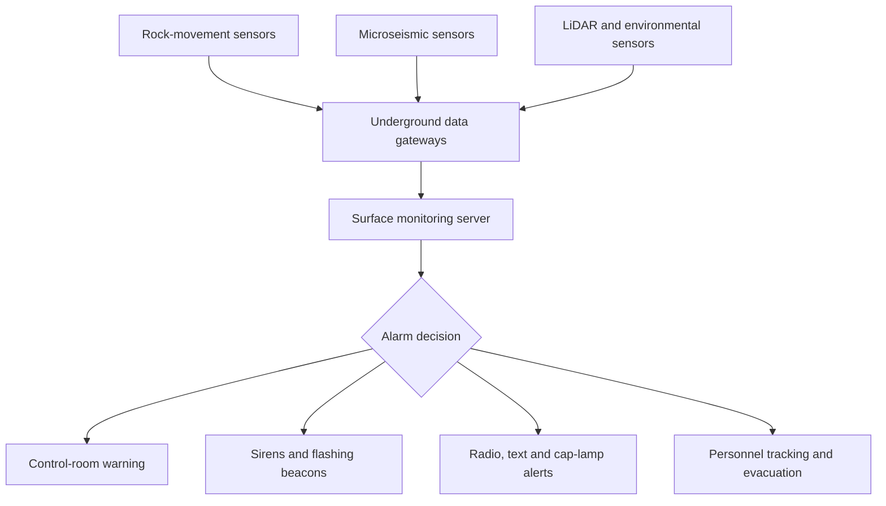
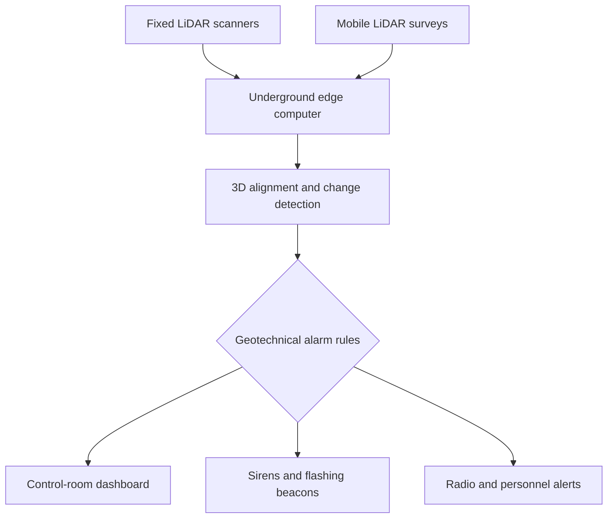
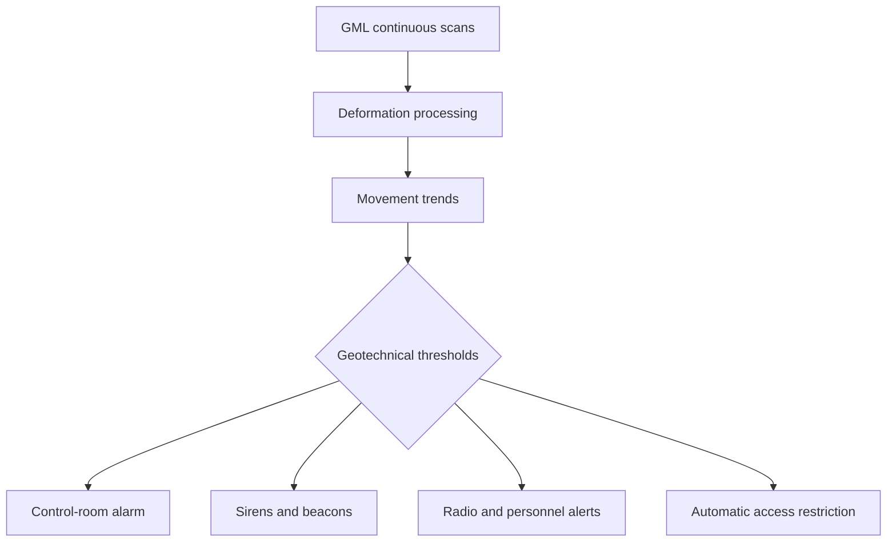

# Gold-Mine Ground Stability Monitoring and Emergency Warning

**Discussion transcript**  
**Compiled:** July 23, 2026

---

## 1. Equipment for predicting a gold-mine tunnel or cave collapse

### User

Is there any measurement/prediction broadcast equipment for gold cave destroying?

### Assistant

Do you mean equipment for predicting a **gold-mine tunnel/cave collapse** and broadcasting an evacuation warning?

If yes, such systems exist. They commonly combine:

- Ground-movement sensors: extensometers, convergence meters, crack meters, and tilt sensors.
- Microseismic/acoustic-emission sensors: detect small rock fractures before a larger failure.
- Ground-penetrating radar or LiDAR: identify voids and measure tunnel-wall deformation.
- Stress and vibration sensors: monitor changing pressure within the surrounding rock.
- Warning equipment: underground sirens, flashing lights, radio/leaky-feeder communication, and personnel-tracking devices.
- Monitoring software: analyzes trends and issues threshold-based alerts.

However, no instrument can guarantee the exact time of a collapse. A qualified mining geotechnical engineer must design the sensor locations and alarm thresholds.

If instead you mean equipment for **detecting an underground cave containing gold**, or equipment for **destroying/excavating a gold-bearing cave**, please clarify which one.

### User

I meant the equipment for predicting a gold-mine tunnel/cave collapse and broadcasting an evacuation warning?

### Assistant

Yes. Equipment exists, but it is usually an integrated **Ground Stability Monitoring and Emergency Warning System**, not one machine. It detects warning signs—movement, cracking, stress changes and seismic activity—and automatically sends evacuation alarms.

Gold itself does not determine the equipment. The correct design depends on the rock mass, tunnel geometry, depth, groundwater, blasting and mining method—especially whether it is conventional tunnelling or block/sublevel caving.

### Recommended system structure

#### Fixed ground-movement sensors

These provide continuous measurements at known dangerous locations.

| Equipment | What it measures | Typical installation |
|---|---|---|
| Multipoint borehole extensometer | Movement at different depths inside the rock | Roof, hanging wall and pillars |
| Wire or rod extensometer | Opening of cracks or separation of rock layers | Across fractures and roof zones |
| Convergence meter | Tunnel roof-to-floor or wall-to-wall closure | Across underground drives |
| Load cell/pressure cell | Load placed on rock bolts and supports | Roof bolts, cable bolts and pillars |
| Crack meter | Changes in visible fracture width | Known cracks and joints |
| Inclinometer/ShapeArray | Bending and displacement inside boreholes | Weak walls and shear zones |
| Piezometer | Groundwater pressure | Wet rock masses and fault zones |
| Tiltmeter | Small angular movement | Roof, wall or structural support |

A practical system should use intrinsically safe or mine-approved sensors where explosive gases or other ignition risks may be present.

#### LiDAR convergence monitoring

A fixed or mobile LiDAR scanner repeatedly scans the complete tunnel surface. Software compares each scan with the reference scan to detect:

- Roof sagging
- Wall bulging
- Tunnel closure
- Rock-support deformation
- New material falling from the surface

GroundProbe’s GML underground system, for example, is designed for full-area convergence monitoring and reports submillimetre movement capability. Mobile SLAM LiDAR systems can inspect longer sections, but fixed scanners are generally more appropriate for continuous monitoring of a critical zone.

Sources: [GroundProbe underground monitoring](https://www.orica.com/en/resource-hub/news/2017/groundprobe-launches-new-industry-disrupting-underground-monitoring-system-the-gml-underground), [Emesent convergence monitoring](https://www.emesent.com/blog/2024/08/16/beyond-the-surface-emesent-innovates-convergence-monitoring)

#### Microseismic and acoustic-emission monitoring

Geophones or accelerometers installed in boreholes detect very small fractures occurring inside the rock. The monitoring software analyzes:

- Number of seismic events
- Event locations
- Released energy
- Apparent volume
- Clustering near tunnels or pillars
- Increasing event rate following blasting
- Periods of unusual seismic quiet after strong activity

This is especially valuable in deep mines, burst-prone rock and large caving operations. However, microseismic activity alone should not automatically be interpreted as an imminent collapse; it must be correlated with deformation, geology and mining activity.

#### Local rock-fall detection

For particularly dangerous headings, additional instruments can include:

- Geophones attached to tunnel supports
- Acoustic-emission sensors
- Trip-wire or barrier sensors
- Rock-fall impact switches
- CCTV or thermal cameras
- Dust and vibration sensors

These are useful for detecting an event that is already beginning, but they normally offer less prediction time than extensometers, LiDAR or microseismic monitoring.

### Evacuation-warning equipment

The alarm network should contain several independent channels because a collapse may break power and communication cables:

- Underground sirens and voice annunciators
- Red/amber flashing beacons
- Leaky-feeder VHF/UHF radio system
- Wi-Fi or industrial mesh network
- Text alerts to mine radios or cap-lamp receivers
- Through-the-earth or ultra-low-frequency emergency messaging
- Personnel-location tags
- Surface control-room alarms
- Battery-backed underground gateways
- Independent emergency power supplies

MSHA maintains information about underground mine communication and personnel-tracking technologies. A good design should allow the control room to identify which miners remain inside the affected zone.

Source: [MSHA communications and tracking](https://www.msha.gov/compliance-and-enforcement/equipment-approval-certification/communications-and-tracking-underground-mines)

### Warning logic

Do not evacuate based on an arbitrary single sensor value. Use a geotechnical trigger-action-response plan, commonly called a TARP.

| Level | Example condition | Response |
|---|---|---|
| Green | Normal movement within expected trend | Continue operation and monitoring |
| Yellow | Abnormal movement or rising microseismic activity | Increase measurement frequency; geotechnical review |
| Orange | Accelerating deformation or multiple independent indicators | Stop work, restrict access and prepare evacuation |
| Red | Critical displacement rate, rapid acceleration or confirmed instability | Automatic alarm and immediate evacuation |

The actual limits must be calculated for that specific mine. For example, “5 mm means evacuate” could be dangerously late in one rock mass and unnecessarily sensitive in another.

### Prediction limitation

These systems provide **early warning**, not a guaranteed collapse-time prediction. Some failures accelerate gradually and may give hours or days of warning. Brittle roof falls and rockbursts can occur with very little measurable warning.

Therefore, the monitoring system must supplement—not replace:

- Geological and geotechnical mapping
- Ground-support design
- Scaling and inspection
- Controlled blasting procedures
- Exclusion zones
- Secondary escape routes
- Emergency drills
- Routine testing of alarms and backup power

For a small underground gold mine, start with fixed extensometers and convergence sensors in critical areas, periodic LiDAR surveys, a leaky-feeder radio system, sirens/beacons and personnel tracking. A deep, highly stressed or block-caving mine should add a full microseismic array, continuous LiDAR/convergence monitoring and a 24/7 geotechnical monitoring room.

---

## 2. Ground Stability Monitoring and Emergency Warning using only LiDAR

### User

Can we get the info for Ground Stability Monitoring and Emergency Warning with only LiDAR?

### Assistant

Yes—with **LiDAR as the only ground-deformation sensor**, you can build a useful Ground Stability Monitoring and Emergency Warning System. However, LiDAR cannot be the only equipment in the complete system: you still need a processing computer, communication network, alarm devices, backup power and human/geotechnical oversight.

> A LiDAR-only system can detect visible tunnel deformation and issue early warnings, but it cannot detect every type of impending collapse.

### Information obtainable from LiDAR

Repeated 3D scans can provide:

- Tunnel roof, wall and floor displacement
- Roof sag and wall-to-wall convergence
- Tunnel-profile reduction
- Bulging, squeezing or buckling
- Changes to shotcrete, mesh and ground support
- Newly detached or fallen rock
- Deformation heat maps
- Displacement velocity, such as mm/hour
- Acceleration of movement
- Approximate fallen-rock or displaced-rock volume
- Location and size of changing areas
- Changes following excavation or blasting

The important point is that one scan only creates a map. Prediction requires repeated scans:

\[
\text{Displacement} = \text{Current surface} - \text{Reference surface}
\]

\[
\text{Velocity} = \frac{\Delta\text{Displacement}}{\Delta\text{Time}}
\]

\[
\text{Acceleration} = \frac{\Delta\text{Velocity}}{\Delta\text{Time}}
\]

A tunnel closing by 1 mm each day may be relatively stable, while movement increasing from 1 to 2, 5 and then 12 mm per hour is much more concerning. The dangerous signal is frequently **acceleration**, not merely total displacement.

### Suitable LiDAR configurations

#### Fixed 3D LiDAR scanner

This is the strongest LiDAR-only option for a critical tunnel section:

- Permanently installed in the monitored zone
- Automatically scans the roof, walls and floor
- Compares every scan with a fixed reference
- Provides frequent measurements
- Can generate automatic alarms
- Must have a stable surveyed mounting position

A system such as GroundProbe GML-Underground provides wide dome coverage and is designed to measure rock and support movement. The manufacturer reports submillimetre capabilities under suitable conditions.

Source: [GroundProbe GML-Underground](https://www.orica.com/en/resource-hub/news/2017/groundprobe-launches-new-industry-disrupting-underground-monitoring-system-the-gml-underground)

Best use: high-risk intersections, stopes, access drives, crusher chambers and areas showing active deformation.

#### Fixed laser convergence sensor

This is a laser distance sensor rather than a complete 3D LiDAR scanner:

- Measures one line from one wall to the opposite wall
- Less expensive and easier to install
- Suitable for continuous convergence trends
- Does not see deformation outside its measurement line

Sandvik’s xCell Cyclops continuously measures tunnel width using laser technology and transmits convergence data for remote assessment.

Source: [Sandvik xCell Cyclops](https://www.mining.sandvik/en/news-and-media/news-archive/2023/02/sandvik-launches-digital-convergence-system-for-ground-support/)

Best use: installing many measurement points along long drives.

#### Mobile SLAM LiDAR

The scanner can be carried, mounted on a vehicle or attached to a drone:

- Covers large portions of the mine
- Produces complete 3D tunnel maps
- Detects rock falls and convergence between surveys
- Reduces the need for workers to remain in hazardous areas
- Is normally periodic rather than continuously watching one location

The difficult part is accurately aligning scans taken at different times. Registration errors can look like rock movement. NIOSH-supported research has examined SLAM LiDAR for underground convergence and rock-fall detection.

Source: [NIOSH LiDAR research](https://stacks.cdc.gov/view/cdc/212648)

Best use: mine-wide inspection combined with fixed scanners at critical locations.

### Practical LiDAR-only architecture

A workable installation would contain:

- Fixed industrial LiDAR scanners
- Stable mounting brackets and surveyed reference targets
- Rugged underground edge computer
- Ethernet, fiber, Wi-Fi mesh or leaky-feeder connection
- Surface monitoring server
- Point-cloud comparison software
- Alarm-rule engine
- Control-room dashboard
- Sirens and flashing beacons
- Radio or cap-lamp notification
- UPS and underground battery backup
- Data storage and event logs

Therefore, “LiDAR-only” should mean **LiDAR is the only geotechnical sensor**, not that a LiDAR unit alone performs the entire safety function.

### Example warning logic

The limits below are examples only—not mine-design values.

| Level | LiDAR observation | Possible response |
|---|---|---|
| Green | Movement inside normal baseline | Continue monitoring |
| Yellow | Unusual displacement or new local deformation | Increase scanning frequency and request review |
| Orange | Movement velocity increasing or deformation spreading | Stop work and restrict access |
| Red | Rapid acceleration or major surface change | Automatic alarm and immediate evacuation |
| Sensor fault | Scanner blocked, moved or data quality lost | Treat monitoring as unavailable; restrict entry according to procedure |

Alarm logic should consider:

- Total displacement
- Movement rate
- Acceleration
- Size of the moving area
- Location relative to workers
- Persistence across multiple scans
- Recent blasting or excavation
- Scan quality and confidence

Do not configure automatic evacuation using only one noisy scan. A safer trigger would require either a very large critical change or confirmation across several consecutive scans.

### What LiDAR cannot detect reliably

LiDAR only measures surfaces that the laser can see. It normally cannot detect:

- Stress building deep inside the rock
- Hidden cracks behind shotcrete or mesh
- Separation several metres above the roof
- Internal pillar damage before surface deformation
- Microseismic fractures or rockburst precursors
- Groundwater pressure behind the rock
- Failure hidden behind equipment or other obstructions
- Sudden brittle collapse with little prior surface movement

It can also produce poor or misleading results because of:

- Dust, fog, smoke or water droplets
- Moving vehicles and workers
- Scanner vibration or accidental movement
- Reflective or wet surfaces
- Line-of-sight shadows
- Incorrect scan registration
- Changes caused by installed pipes, mesh or equipment
- Power or communication failure

Mobile scans are particularly dependent on accurate scan alignment.

Source: [Emesent LiDAR convergence monitoring](https://www.emesent.com/blog/2024/08/16/beyond-the-surface-emesent-innovates-convergence-monitoring)

### Practical recommendation

For a cost-conscious gold mine, a reasonable LiDAR-centered design would be:

- Mobile SLAM LiDAR for scheduled inspection of the entire accessible mine
- Fixed 3D LiDAR at each identified high-risk zone
- Low-cost fixed laser convergence sensors between those zones
- Automated movement, velocity and acceleration analysis
- Independent sirens, beacons and radio alerts
- Battery-backed communication and processing
- Geotechnical engineer-defined alarm thresholds

If the mine is deep, seismically active, uses block caving, or has rockburst risk, LiDAR should **not** be approved as the sole ground-stability sensor. Microseismic monitoring, borehole extensometers and possibly stress or water-pressure instruments should supplement it.

---

## 3. GroundProbe GML-Underground details

### User

Give me the info for the GroundProbe GML-Underground in more detail.

### Assistant

The **GroundProbe GML-Underground**—Geotech Monitoring LiDAR—is a high-precision laser scanning system designed specifically for underground convergence and surface-deformation monitoring.

It is not ground-penetrating radar and does not look inside the rock. It repeatedly scans the visible excavation surface and measures how the rock, shotcrete, mesh, bolts and other support components move over time.

GroundProbe was acquired by Orica, so current sales and support are handled through **Orica Digital Solutions/GroundProbe**.

### Confirmed published specifications

| Parameter | Published information |
|---|---|
| Technology | 3D LiDAR with GroundProbe deformation-processing software |
| Primary application | Underground convergence and ground-support monitoring |
| Scan coverage | 360° horizontal × 270° vertical |
| Measurement capability | Manufacturer states submillimetre movement detection under suitable conditions |
| Output | Time-stamped 3D point cloud and surface-deformation maps |
| Surface coverage | Rock, shotcrete, mesh, bolt plates and other visible surfaces |
| Deployment | Portable tripod-based periodic monitoring or fixed continuous monitoring |
| Software | Originally integrated with SSR-Viewer and its Convergence Monitoring Module |
| Environment | Underground drives, intersections, stope entrances and infrastructure |
| Interference advantage | Unlike underground radar, it avoids radar multipath interference from walls and metal |
| Monitoring style | Periodic campaigns or continuous installation |

GroundProbe was still describing GML and its Convergence Monitoring Module as an underground system in a 2025 company article. However, its complete current datasheet is not publicly posted, so range, power, environmental rating, dimensions and present software compatibility require confirmation from GroundProbe.

Source: [GroundProbe’s 2025 technology overview](https://www.groundprobe.com/the-different-types-of-radars-in-mining-engineering/)

### How the system works

#### Reference installation

The scanner is placed on a stable tripod or permanent mounting point. For periodic monitoring, permanent reference targets are installed on parts of the excavation expected to remain stable.

A published Goldex and Pinos Altos mine trial used between three and five targets for georeferencing.

#### Initial reference scan

The GML rotates and records millions of XYZ surface points. These points create a three-dimensional reference model of:

- Roof
- Walls
- Floor
- Shotcrete
- Mesh
- Bolt plates
- Barricades
- Other support structures

The reference scan represents the initial surface condition.

#### Repeated scanning

A new scan is collected after a chosen interval:

- Before and after blasting
- Every shift
- Daily or weekly
- Continuously at an active deformation zone
- Before and during backfilling
- During rehabilitation work

Periodic monitoring requires returning the scanner to the same location and georeferencing it again. Continuous monitoring leaves the scanner fixed, reducing repositioning and registration errors.

#### Deformation calculation

The software aligns the new scan with the reference and divides the surface into measurement pixels. It calculates whether each surface section moved:

- Toward the scanner
- Away from the scanner
- At what rate
- Over what area
- During which interval

The results are presented as a colored deformation map. For example:

- Green: little or no movement
- Yellow: noticeable movement
- Orange: elevated movement
- Red: high or accelerating movement

The actual colors and limits are configurable and must be selected by the mine’s geotechnical team.

### Published field workflow

A 2019 technical paper describing trials at Goldex and Pinos Altos reported the following approximate periodic-scan workflow:

| Operation | Approximate time |
|---|---:|
| Position and prepare the scanner | 10 minutes |
| Scan reference targets/georeference | 10 minutes |
| Complete 360° scan | 7 minutes |
| Transfer data using Wi-Fi | 3 minutes |
| Total before detailed processing | Approximately 30 minutes |

These are field-trial figures, not guaranteed current product specifications. A permanent installation can operate differently and avoids repeated physical setup.

The trial completed more than 200 scans and used the system to evaluate rock deformation, ground-support performance, blasting response and the effects of bolt type and spacing.

Source: [Agnico Eagle GML field study](https://papers.acg.uwa.edu.au/d/1925_02_Gelinas/02_Gelinas.pdf)

### Information it can produce

#### Excavation deformation

- Roof sag
- Side-wall bulging
- Floor heave
- Tunnel closure
- Localized convergence
- Deformation spreading across a larger area
- Surface response following a blast

#### Ground-support behavior

- Movement around bolt plates
- Differential movement between bolts
- Loose or ineffective bolt plates
- Shotcrete deformation
- Mesh deformation
- Areas deforming between bolts
- Comparative behavior of different support arrangements

#### Quantitative analysis

- Cumulative displacement in millimetres
- Displacement over a selected period
- Velocity in mm/hour or mm/day
- Acceleration of movement
- Average displacement across a selected region
- Local maximum movement
- Time history for selected surface regions

The field study averaged rock-surface measurements over approximately 30 × 30 cm areas and bolt measurements over approximately 10 × 10 cm areas. Averaging reduces individual point noise and gives a more meaningful regional trend.

### Periodic versus continuous operation

| Feature | Periodic monitoring | Continuous monitoring |
|---|---|---|
| Scanner position | Removed and returned later | Remains fixed |
| Mine coverage | One unit can visit many locations | Dedicated to one critical location |
| Measurement interval | Hours, days or weeks | Minutes or other configured interval |
| Registration error | Higher | Lower |
| Emergency-warning suitability | Limited | Better |
| Best purpose | Inspection and engineering analysis | Active hazard monitoring |
| Cost per monitored area | Lower | Higher |

For evacuation warning, the GML should be permanently installed and continuously connected. A scanner used manually once per day cannot warn workers about a collapse developing between surveys.

### Emergency-warning integration

The GML is principally a monitoring instrument. A complete evacuation system requires additional infrastructure:

The system should monitor:

- Total surface displacement
- Movement velocity
- Acceleration
- Size of the deforming area
- New zones becoming active
- Persistence across multiple scans
- Scan confidence and sensor health

| State | Example meaning | Response |
|---|---|---|
| Normal | Expected background movement | Normal operation |
| Advisory | Movement outside established baseline | Engineering review |
| Warning | Persistent or accelerating movement | Stop work and clear affected zone |
| Critical | Rapid acceleration or severe deformation | Automatic evacuation alarm |
| Monitoring unavailable | Scanner moved, blocked or offline | Treat area as unmonitored; restrict entry |

These thresholds cannot be copied from another mine. They must be calculated from local geology, support design, expected convergence and historical behavior.

### Important field applications

Published trials have applied GML to:

- Gold-mine development drives
- Stope entrances
- Large underground infrastructure
- Shotcrete-lined roofs and walls
- Seismically active areas
- Rock response before and after blasting
- Bolt-spacing and bolt-type evaluation
- Paste-fill barricade monitoring
- Water-related transient deformation
- Identification of localized support problems

One published case reported the system identifying substantial localized rock deformation around an ineffective roof-support element that was not obvious from surrounding measurements.

### Advantages

- Measures a complete visible surface instead of isolated points
- Produces an intuitive deformation heat map
- Detects small movement that workers may not see
- Measures both rock and ground-support response
- Suitable for difficult tunnel geometry
- Can compare conditions before and after blasting
- Reduces the need to approach an unstable surface
- Can be portable or permanently installed
- Metal mesh and bolts do not create the radar-multipath problem associated with underground radar

The manufacturer states 360° × 270° coverage and submillimetre capability. These are manufacturer performance claims and should be verified by an on-site acceptance test under actual dust, range, surface and vibration conditions.

Source: [Orica’s GML launch information](https://www.orica.com/en/resource-hub/news/2017/groundprobe-launches-new-industry-disrupting-underground-monitoring-system-the-gml-underground)

### Limitations

#### It measures only visible surfaces

It cannot directly measure:

- Deep rock stress
- Fractures behind shotcrete
- Separation above the roof
- Groundwater pressure
- Microseismic cracking
- Internal pillar damage
- Rockburst energy

#### Mesh may hide the real rock surface

The laser may measure loose rock retained against the mesh rather than the stable rock behind it. The published field study specifically notes that loose material behind mesh can mask deformation and affect results.

#### Line-of-sight restrictions

Equipment, ventilation ducts, pipes, vehicles and structural components can create blind zones.

#### Environmental effects

Dust, water spray, condensation, smoke, scanner vibration and dirty optics may reduce data quality.

#### Sudden failures

Some brittle roof falls or rockbursts may occur without a long, measurable surface-deformation trend. Therefore, the system cannot guarantee that every collapse will be predicted.

### Procurement information that requires vendor confirmation

GroundProbe does not publish a complete current commercial datasheet or list price. A quotation should request:

- Maximum recommended underground monitoring range
- Accuracy and precision at several distances
- Minimum detectable deformation
- Point-cloud density and angular resolution
- Scan and processing time
- Maximum automatic scan frequency
- Scanner weight and dimensions
- Tripod and permanent-mount dimensions
- Operating-temperature range
- IP dust/water rating
- Laser safety classification
- Mine electrical or intrinsic-safety certification
- Input voltage and power consumption
- Battery operation and backup duration
- Ethernet, fiber and Wi-Fi requirements
- Local versus cloud processing
- Alarm relay, API and protocol support
- Compatibility with MonitorIQ Next or current GroundProbe software
- Data export formats
- Siren/PLC/SCADA integration
- Licensing and annual support costs
- Calibration requirements
- Training, commissioning and warranty
- Confirmation that GML-Underground remains orderable in the buyer’s country

For a purchase decision, the most important step is a mine-site demonstration comparing GML readings against known survey targets or extensometers, followed by a formal acceptance test.

---

## 4. GroundProbe GML-Underground price

### User

Give me the price for the GroundProbe GML-Underground.

### Assistant

GroundProbe does not publish a fixed price for the GML-Underground. It is sold by quotation as an industrial monitoring package.

A reasonable **preliminary budget estimate** is:

| Scope | Estimated price, USD |
|---|---:|
| GML scanner and basic accessories | $150,000–$300,000 |
| Convergence-processing software and workstation | $40,000–$120,000 |
| Training, commissioning and initial support | $20,000–$60,000 |
| **Portable periodic-monitoring package** | **$210,000–$480,000** |
| Continuous installation, networking and backup power | Additional $50,000–$150,000 |
| Sirens, beacons, PLC/SCADA and radio integration | Additional $30,000–$150,000 |
| **Complete continuous warning installation** | **Approximately $300,000–$750,000** |
| Annual software/support/calibration | Approximately $20,000–$80,000/year |

These figures are planning estimates, **not a published GroundProbe quotation**. Final cost will depend on country, mine location, monitoring range, installation method, software licensing, training and alarm integration.

The “AUD $23.81” sometimes appearing in search snippets for Orica’s GML announcement is unrelated page metadata—not the equipment price.

For quotation purposes, contact [GroundProbe/Orica Digital Solutions](https://www.orica.com/digital-solutions/geosolutions/groundprobe). Ask for separate prices for:

1. GML-Underground scanner
2. Tripod and permanent mounting kit
3. Reference targets
4. Current Convergence Monitoring Module
5. SSR-Viewer or MonitorIQ compatibility
6. Processing workstation
7. Continuous monitoring license
8. Alarm relay/API/SCADA integration
9. Commissioning and acceptance testing
10. Operator and geotechnical training
11. Freight, import duties and warranty
12. Annual software and technical-support fees

For initial financial planning, reserve **about $450,000 for one operational monitoring station** and **$600,000–$750,000** if it must include automatic underground evacuation warnings and redundant communications. GroundProbe should also confirm that the GML is currently orderable in the buyer’s country before the project budget is approved.

---

## Important safety and commercial notes

- LiDAR and other monitoring systems provide early warning; they cannot guarantee that every collapse will be predicted.
- Site-specific alarm thresholds must be designed and approved by a qualified mining geotechnical engineer.
- A safety system must include tested alarms, backup power, redundant communications, evacuation routes and emergency procedures.
- Prices in this document are preliminary planning estimates, not manufacturer quotations.
- Product availability, technical specifications, certifications and current software compatibility should be confirmed directly with GroundProbe/Orica.

